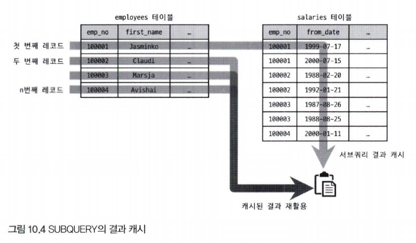

## 1. 통계 정보
- 8.0부터 인덱스되지 않은 칼럼들에 대해서도 데이터 분포도를 수집해서 저장하는 히스토그램 정보가 도입되었다

### 1. 테이블 및 인덱스 통계 정보
- 비용 기반 최적화에서 제일 중요한 것은 통계 정보이다
- 통계정보가 정확하지 않다면 엉뚱항 방향으로 쿼리를 실행할 수 있기 때문이다

#### 1. MySQL 서버의 통계 정보
- 5.5버전까지는 메모리에서만 저장됐으며 통계 정보가 갱신되면 인덱스를 잘 타지 못하는 상황도 생겼다
- 5.6부터 각 테이블의 통계 정보를 `innodb_index_stats`테이블과 `innodb_table_stats`테이블로 관리할 수 있게 개선됐다
- 통계정보의 각 칼럼은 다음과 같은 값을 저장하고 있다
  - innodb_index_stats.stat_name='n_diff_pfx%': 인덱스가 가진 유니크한 값의 개수
  - innodb_index_stats.stat_name='n_leaf_pages': 인덱스의 리프 노드 페이지 개수
  - innodb_index_stats.stat_name='size': 인덱스 트리의 전체 페이지 개수
  - innodb_index_stats.stat_name='n_rows': 테이블의 전체 레코드 건수
  - innodb_index_stats.stat_name='clustered_index_size': 프라이머리 키의 크기(InnoDB 페이지 개수)
  - innodb_index_stats.stat_name='sum_of_other_index_sizes': 프라이머리 키를 제외한 인덱스의 크기 개수(InnoDB 페이지 개수)

### 2. 히스토그램
- 8.0버전부터 칼럼의 데이터 분포도를 참조할수 있는 히스토그램 정보를 활용할 수 있게 됐다

#### 1. 히스토그램 정보 수집 및 삭제
- 칼럼 단위로 관리되는데 이는 자동으로 수집되지 않고 `ANALYZE TABLE ... UPDATE HISTOGRAM` 명령을 실행해 수동으로 수집 된 관리된다
- 수집된 히스토그램 정보는 시스템 딕셔너리에 함께 저장되고, 서버가 시작될 때 `column_statistics`테이블로 로드한다

```sql
ANALYZE TABLE employees.employees
UPDATE HISTOGRAM ON gener, hire_date;

SELECT *
FROM COLUMN_STATISTICS
WHERE SCHEMA_NAME='employees'
AND TABLE_NAME = 'employees'
```

- 8.0부터 2종류의 히스토그램 타입이 지원된다
  - Singleton(싱글톤 히스토그램): 칼럼값 개별로 레코드 건수를 관리하고, Value-Based 히스토그램 또는 도수 분포라고도 불린다
  - Equi-Height(높이 균형 히스토그램): 칼럼값의 범위를 균등한 개수로 구분해서 관리하는 히스토그램으로, Height-Balanced 히스토그램이라고도 부른다
- 히스토그램은 버킷단위로 구분되어 레코드 건수나 칼럼값의 범위가 관리된다
  - 싱글톤은 칼럼이 가지는 값별로 버킷이 할당되고 각 버킷이 칼럼의 값과 발생 빈도의 비율의 2개의 값을 가진다
  - 높이 균형 히스토그램은 개수가 균등한 칼럼값의 범위별로 하나의 버킷이 할당되고 범위 시작 값과 마지막 값 , 그리고 발생빈도율과 각 버킷에 포함된 유니크한 값의 개수 등 4개의 값을 가진다

```sql
-- 히스토그램 삭제
ANALYZE TABLE employees.employees
DROP HISTOGRAM ON gender, hire_date;

-- 옵티마이저가 히스토그램을 사용하지 않도록 설정
SET GLOBAL optimizer_switch='condition_fanout_filter=off'

```

#### 2. 히스토그램의 용도
- 각 범위(버킷)별로 레코드의 건수와 유니크한 값의 개수 정보를 가지기 때문에 훨씬 정확한 예측을 할 수 있다
- 히스토그램이 없다면 옵티마이저는 데이터가 균등하게 분포돼 있을 것으로 예측한다
- 이는 쿼리의 성능에 상당한 영향을 미칠 수 있다
- 각 칼럼에 대해 히스토그램 정보가 있으면 어느 테이블을 먼저 일겅야 조인의 횟수를 줄일 수 있을지 옵티마이저가 더 정확히 판단할 수 있다

#### 3. 히스토그램과 인덱스
- 히스토그램과 인덱스는 완전히 다르지만 부족한 통계 정보를 수집하기 위해 사용된다는 측면에서는 어느 정도 공통점을 가지고 있다
- 쿼리의 실행계획을 수립할 때 조건절에 일치하는 레코드 건수를 대략 파악하고 최종적으로 가장 나은 실행 계획을 선택한다
  - 레코드 건수를 예측하기 위해 옵티마이저는 실제 인덱스의 B-Tree를 샘플링해서 살펴본다. 이를 `인덱스 다이브`라고 표현한다
  - 인덱스된 칼럼을 검색 조건으로 사용하는 경우 히스토그램을 사용하지 않고 인덱스 다이브를 통해 직접 수집한 정보를 활용한다
  - 히스토그램은 주로 인덱스되지 않은 칼럼에 대한 데이터 분포도를 참조하는 용도로 사용된다

### 3. 코스트 모델(Cost Model)
- MySQL 서버가 쿼리를 처리하려면 다음과 같은 작업을 필요로 한다
  - 디스크로부터 데이터 페이지 읽기
  - 메모리로부터 데이터 페이지 읽기
  - 인덱스 키 비교
  - 레코드 평가
  - 메모리 임시 테이블 작업
  - 디스크 임시 테이블 작업
- MySQL 서버는 사용자의 쿼리에 대해 다양한 작업이 얼마나 필요한지 예측하고 전체 작업 비용을 계산한 결과를 바탕으로 최적의 실행 계획을 찾는다
  - 전체 쿼리의 비용을 계산하는데 필요한 단위 작업들을 코스트모델이라고 한다
- 8.0부터 히스토그램과 각 인덱스 별 메모리에 적재된 페이지의 비율이 관리되고 옵티마이저의 실행 계획 수립에 사용되기 시작했다
- 코스트모델은 다음 2개의 테이블에저장돼 있는 서정 값을 사용한다
  - `servier_cost`: 인덱스를 찾고 레코드를 비교하고 임시 테이블 처리에 대한 비용 관리
  - `engine_cost`: 레코드를 가진 데이터 페이지를 가져오는 데 필요한 비용 관리

## 2. 실행 계획 확인
- 실행 계획은 `DESC` 또는 `EXPLAIN` 명령으로 확인할 수 있다

### 1. 실행 계획 출력 포맷
- `FORMAT`옵션을 사용해 실행 계획 표시 방벙블 JSON이나 TREE, 단순 테이블 형태로 선택할 수 있다

```sql
EXPLAIN FORMAT=TREE
SELECT *
FROM employees e
JOIN salaries s ON s.emp_no=e.emp_no
WHERE first_name='ABC'
```

### 2. 쿼리의 실행 시간 확인
- 8.0.18부터 쿼리의 실행 계획과 단계별 소요된 시간 정보를 확인할 수 있는 `EXPLAIN ANALYZE`기능이 추가됐다
- 항상 Tree포맷으로 보기주기 때문에 FORMAT 옵션을 사용할 수 없다

```sql
-- 들여쓰기는 호출 순서를 의미한다
-- 들여쓰기가 같은 레벨에서는 상단에 위치한 라인이 먼저 실행
-- 들여쓰기가 다른 레벨에서는 가장 안쪽에 위치한 라인이 먼저 실행

-> Table scan on <temporary>  (actual time=58.9..58.9 rows=48 loops=1)
    -> Aggregate using temporary table  (actual time=58.9..58.9 rows=48 loops=1)
        -> Nested loop inner join  (cost=712 rows=124) (actual time=3.68..58.7 rows=48 loops=1)
            -> Index lookup on e using ix_firstname (first_name='Matt')  (cost=254 rows=233) (actual time=3.32..27.4 rows=233 loops=1)
            -> Filter: ((s.salary > 50000) and (s.from_date <= DATE'1990-01-01') and (s.to_date > DATE'1990-01-01'))  (cost=1.01 rows=0.532) (actual time=0.132..0.134 rows=0.206 loops=233)
                -> Index lookup on s using PRIMARY (emp_no=e.emp_no)  (cost=1.01 rows=9.57) (actual time=0.129..0.132 rows=9.53 loops=233)

-- 실행 순서 1. using ix_firstname
-- 실행 순서 2. using PRIMARY
-- 실행 순서 3. Filter
-- 실행 순서 4. Nested loop inner join
-- 실행 순서 5. Aggregate using temporary table
-- 실행 순서 6. Table scan on <temporary>

-- 실제 소요된 시간(actual time)과 처리한 레코드 건수(rows), 반복 횟수(loops)가 표시된다
-- actual time: 0.129..0.132 -> employees 테이블에서 읽은 emp_no 값을 기준으로 salaries 테이블에서 일치하는 레코드를 검색하는 데 걸린 시간을 의미한다
-- rows: 9.53 -> employees 테이블에서 읽은 emp_no 값을 기준으로 salaries 테이블에서 일치하는 레코드의 평균 건수
-- loops: 233 -> employees 테이블에서 읽은 emp_no 값을 기준으로 salaries 테이블을 검색한 횟수. 즉 employees 테이블에서 읽은 emp_no의 개수가 233개임을 의미한다
```

## 3. 실행계획 분석
- 아무런 옵션 없이 EXPLAIN 명령을 실행하면 쿼리 문장의 특성에 따라 표 형태로 된 결과가 표시된다
- 표의 각 라인(레코드)은 쿼리 문장에서 사용된 테이블의 개수만큼 출력된다
- 실행 순서는 위에서 아래로 순서대로 표시된다

| id | select_type | table | type | possible_keys        | key          | key_len | ref                | rows | filtered | Extra |
|----|-------------|-------|------|----------------------|--------------|---------|--------------------|------|----------|-------|
| 1  | SIMPLE      | e     | ref  | PRIMARY,ix_firstname | ix_firstname | 58      | const              | 1    | 100.0    | NULL  |
| 1  | SIMPLE      | s     | ref  | PRIMARY              | PRIMARY      | 4       | employees.e.emp_no | 9    | 100.0    | NULL  |


1	SIMPLE	e		ref	PRIMARY,ix_firstname	ix_firstname	58	const	1	100.0	
1	SIMPLE	s		ref	PRIMARY	PRIMARY	4	employees.e.emp_no	9	100.0	

### 1. id 칼럼
- 단위 SELECT 쿼리별로 부여되는 식별자 값이다
- id는 실행 순서를 보장하지 않고 위에서 아래로 읽는다

```sql
-- 하나의 SELECT 문장안에서 여러 개의 테이블을 조인하면 테이블의 개수만큼 id값이 부여된다
-- 아래와 같이 SELECT 문장은 하나인데, 여러 개의 테이블이 조인되는 경우에는 같은 id가 부여된다
SELECT e.emp_no, e.first_name, s.from_date, s.salary
FROM employees e, salaries s
WHERE e.emp_no = s.emp_no
LIMIT 10;

-- 아래는 3개의 단위 SELECT 쿼리로 구성되어 있으므로 각기 다른 id가 부여된다
SELECT (
  ( SELECT COUNT(*) FROM employees) + (SELECT COUNT(*) FROM departments)
) AS total_count;
```

### 2. select_type 칼럼
- 각 단위 SELECT 쿼리가 어떤 타입의 쿼링ㄴ지 표시되는 칼럼이다

#### 1. SIMPLE
- UNION이나 서브쿼리르 사용하지 않는 SELECT 쿼리의 경우 select_type은 SIMPLE로 표시된다
- 아무리 복잡하더라도 SIMPLE인 단위 쿼리는 하나만 존재한다
- 일반적으로 제일 바깥 SELECT 문장이 SIMPLE로 표시된다

#### 2. PRIMARY
- UNION이나 서브쿼리를 가지는 SELECT 쿼리 실행 계획에서 가장 바깥쪽에 있는 단위 쿼리는 PRIMARY로 표시된다
- SIMPLE과 같이 PRIMARY인 단위 쿼리는 하나만 존재한다

#### 3. UNION
- UNION으로 결합하는 단위 SELECT 쿼리 가운데 첫 번째를 제외한 두 번째 이후 쿼리에 UNION으로 표시된다
- UNION의 첫 번째 단위 SELECT는 임시 테이블(DERIVED)이 표시된다

#### 8. DERIVED
- 메모리나 디스크에 임시 테이블을 생성하는 것을 의미한다
- 파생 테이블에 대한 최적화가 부족한 버전이라면 가능하다면 DERIVED 형태의 실행 계획을 조인으로 해결할 수 있게 바꾸는 것이 좋다
  - 8.0부터는 서브쿼리도 최적화도 많이 개선되었지만 옵티마이저에게도 한계가 있어 최적화된 쿼리를 작성하는 것이 중요하다

#### 10. UNCACHEABLE SUBQUERY
- 조건이 똑같은 서브쿼리가 실행될 때 실행 결과를 캐시에 담아 사용한다
- 쿼리 캐시나 파생 테이블(DERIVED)과는 무관한 기능이다
- 서브쿼리가 캐시 자체가 불가능할 수 도 있는데 이럴 때는 `UNCACHEABLE SUBQUERY`로 표시된다
  - 사용자 변수가 서브쿼리에 사용된 경우
  - NOT-DETERMINISTIC 속성의 스토어드 루틴이 서브쿼리 내에 사용된 경우
  - UUID()나 RAND()와 같이 결과값이 호출할 때마다 달라지는 함수가 서브쿼리에 사용된 경우



#### 12. MATERIALIZED
- 서브쿼리의 내용을 임시 테이블로 구체화한 후 , 임시 테이블과 employees 테이블을 조인하는 것을 의미한다

```sql
SELECT *
FROM employees e
WHERE e.emp_no IN (
  SELECT emp_no
  FROM salaries
  WHERE BETWEEN 100 AND 1000
)
```

### 3. table 칼럼
- 테이블명을 의미하며 `<Derived N>` 또는 `<union M,N>`과 같은 경우는 임시 테이블을 의미한다
- table에 derived 2가 있고 그 아래에 있다면 그 행부터 실행한다음 시작한다는 것을 의미한다

### 4. partitions 칼럼
- 어느 파티션에서 읽는지 확인하는 칼럼이다

### 5. type 칼럼
- 레코드를 어떤 방식으로 읽었는지를 나타낸다
  - 인덱스로 읽었는지 풀 테이블 방식으로 읽었는지를 의미한다
- 실행 계획에서 반드시 체크해야 할 중요한 정보이다
- ALL을 제외한 나머지는 모두 인덱스를 사용한 접근 방법이다

#### 1. system
- 레코드가 1건만 존재하는 테이블 또는 한 건도 존재하지 않는 테이블을 참조하는 형태의 접근 방법이다
- MyISAM이나 MEMORY에서만 사용되는 접근방법이다

#### 2. const
- 프라이머리 키나 유니크 키 칼럼을 이용하는 WHERE절을 가지고 있으며 반드시 1건을 반환하는 쿼리의 처리 방식이다
- 다른 DBMS에서는 이를 유니크 인덱스 스캔이라고도 표현한다
- 프라이머리 키의 일부만 조건으로 사용할 때는 `ref`로 표시된다

```sql
-- 프라이머리 키나 유니크 인덱스의 모든 칼럼을 동등 조건으로 사용하면 const로 표시된다
SELECT *
FROM employees
WHERE emp_no = 10001;
```

#### 3. eq_ref
- 조인할 때 **결과가 무조건 1건**만 나오는 가장 빠른 방식 (Const 제외)
- 여러 테이블을 조인할 때 (첫 번째 테이블 말고 그 이후 테이블에서) 조인 조건이 **PK(Primary Key)**나 **유니크 키(Unique Key)**여서 **딱 1건만 매칭됨**이 보장될 때 사용한다

```sql
SELECT *
FROM dept_emp de, employees e
WHERE e.emp_no=de.emp_no
AND de.emp_no='d005';
```

#### 4. ref
- 조인의 순서와 관계없이 사용되며 반드시 1건이 매칭되는 보장이 없을 때 표시된다
- 동등조건에서만 사용되므로 매우 빠른 레코드 조회 방법중 하나이다

```sql
SELECT *
FROM dept_emp de
WHERE de.dept_no='d005';
```

#### 5. fulltext
- 전문 검색 인덱스를 사용할 때 표시된다

#### 6. ref_or_null
- ref와 동일하지만 NULL값을 허용하는 경우에 표시된다
- 말 그대로 ref 또는 nul 비교(is null) 접근 방법을 의미한다

#### 7. unique_subquery
- WHERE절에서 `IN (subquery)` 쿼리를 위한 접근 방법이다
- 서브쿼리에서 중복되지 않은 유니크한 값만 반환할 때 이 방법을 사용한다

#### 8. index_subquery
- 서브쿼리 결과의 중복된 값을 인덱스를 이용해서 제거할 수 있을 때 사용된다

>##### unique_subquery와 index_subquery의 차이점
- unique_subquery: IN (subquery) 형태에서 반환 값에 중보깅 없으므로 별도의 중복 제거 작업이 필요하지 않는다
- index_subquery: IN (subquery) 형태에서 반환 값에 중복이 있을 수 있지만 인덱스를 이용해 중복된 값을 제거할 수 있다

#### 9. range
- 인덱스 레인지 스캔 형태의 접근 방법이다
- 주로 BETWEEN, >=, <=, >, <, LIKE '문자%' 등의 연산자를 사용할 때 표시된다
- range 접근 방법도 상당히 빠르며 최적의 성능이 보장된다

```sql
SELECT * FROM employees WHERE emp_no BETWEEN 10000 AND 20000;
```

>##### 주의
> 인덱스 레인지 스캔은 const, ref, range 세 가지 접근 방법을 묶어서 지칭한다

#### 10. index_merge
- 2개 이상의 인덱스를 이용해 각각의 검색 결과를 만들고 병합해서 처리하는 방식이다
- 다음과 같은 특징이 있다
  - 여러 인덱스를 읽어야 하므로 range보다 효율성이 떨어진다
  - 전문 검색 인덱스를 사용하는 경우에는 적용되지 안흔다
  - 항상 2개 이상의 집합이 되기 때문에, 교집합이나 합집합 또는 중복 제거같은 부가적인 자겅ㅂ이 더 필요하다

#### 11. index
- 인덱스 풀 스캔을 의미한다
- 풀 테이블 스캔과 레코드 건수는 같지만 파일 전체 크기가 작으므로 더 빠르다고 할 수 있다
- 다음 조건 가운데 1, 2번째 또는 1, 3번째 조건을 충족하는 쿼리에서 사용되는 방식이다
  - range나 const, ref같은 접근 방법으로 인덱스를 사용하지 못하는 경우
  - 인덱스를 포함한 칼럼만으로 처리할 수 있는 쿼리인 경우(즉 데이터 파일을 읽지 않아도 되는 경우)
  - 인덱스를 이용해 정렬이나 그루핑 작업이 가능한 경우(즉 별도의 정렬 작업을 피할 수 있는 경우)

#### 12. ALL
- 풀 테이블 스캔을 의미하는 접근 방법이다
- 한꺼번에 많은 페이지를 읽어 들이는 기능(리드 어헤드)가 있지만 온라인 트랜잭션 처리환경에는 적합하지 않다

### 6. possible_keys 칼럼
- 최적의 실행 계획 후보로 선정했던 인덱스 목록을 의미한다
- 특별한 경우를 제외하고는 그냥 무시해도 된다

### 7. key 칼럼
- 실제로 사용된 인덱스를 의미한다
- type이 ALL일 때와 같이 인덱스를 전혀 사용하지 못하면 NULL로 표시된다

### 8. key_len 칼럼
- 실제로 사용된 인덱스의 길이를 의미한다
- 인덱스의 각 레코드에서 몇 바이트까지 사용했는지 알려주는 값이다
- 예를 들어 16으로 표시됐으면 CHAR(4)인 경우에는 앞쪽 16바이트만 유효하게 사용했다는 의미이다
  - utf8mb4인 경우에는 4바이트로 계산하기 때문에 16바이트(4 *4바이트)가 표시된 것이다

### 9. ref 칼럼
- 참조 조건으로 어떤 값이 제공됐는지 보여준다
- 상숫값을 지정했다면 const로 표시되고, 다른 테이블의 칼럼값이면 그 테이블명과 칼럼명이 표시된다
- func으로 표시될 때는 콜레이션 변환이나 값 자체의 연산을 거쳐서 참조됐다는 것을 의미한다

```sql
SELECT *
FROM employees e, dept_emp de
WHERE e.emp_no = de.emp_no
AND de.emp_no = (de.emp_no - 1)
```

### 10. rows 칼럼
- 실행 계획을 수립할 때 예상했던 레코드 건수를 의미한다
  - 각 인덱스 값의 분포도가 어떤지를 통계 정보를 기준으로 조사해서 예측한다
- 레코드의 예측치가 아니라 쿼리를 처리하기 위해 얼마나 많은 레코드를 읽고 체크해야 하는지를 의미하기 때문에  실제 반환된 레코드 건수와 일치하는 경우가 많다

### 11. filtered 칼럼
- 실행 계획을 수립할 때 예상했던 레코드 비율을 의미한다
- 100으로 표시되면 모든 레코드를 읽어서 체크했다는 의미이고, 10으로 표시되면 10%만 읽어서 체크했다는 의미이다
- 즉 rows가 233이고 filtered가 16.03이면 조건에 일치하는 레코드가 대략 233건이며 이 중에서 16.03% 인 37만 수행한다는 뜻이다
- filtered 값이 얼마나 정확히 예측하느냐에 따라 조인의 성능이 달라진다
- 더 정확히 예측할수 있도록 히스토그램 기능이 도입됐다

### 12. Extra 칼럼
- 실행 계획에 대한 추가적인 정보를 제공한다

