## 1. 디스크 읽기 방식
- 디스크 읽기 방식에는 크게 랜덤 I/O와 순차 I/O가 있다

### 1. 하드 디스크 드라이브(HDD)와 솔리드 스테이트 드라이브(SSD)
- CPU, 메모리등과 다르게 HDD는 기계식이라 병목이 된다
- 이를 대체하는 전자식 저장 매체인 SSD가 있고, 이는 기존 원판을 회전하는 방식이 아닌 플래시 메모리를 사용하고 있어 빠르다

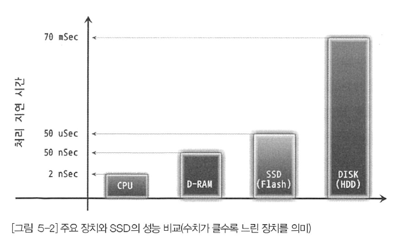

- 하지만 순차 I/O에서는 SSD가 비슷하거나 조금 빠른 성능을 보인다

### 2. 랜덤 I/O와 순차 I/O
- 랜덤 I/O: HDDD의 원판을 돌려서 이동시킨 다음 데이터를 읽는 것을 의미한다

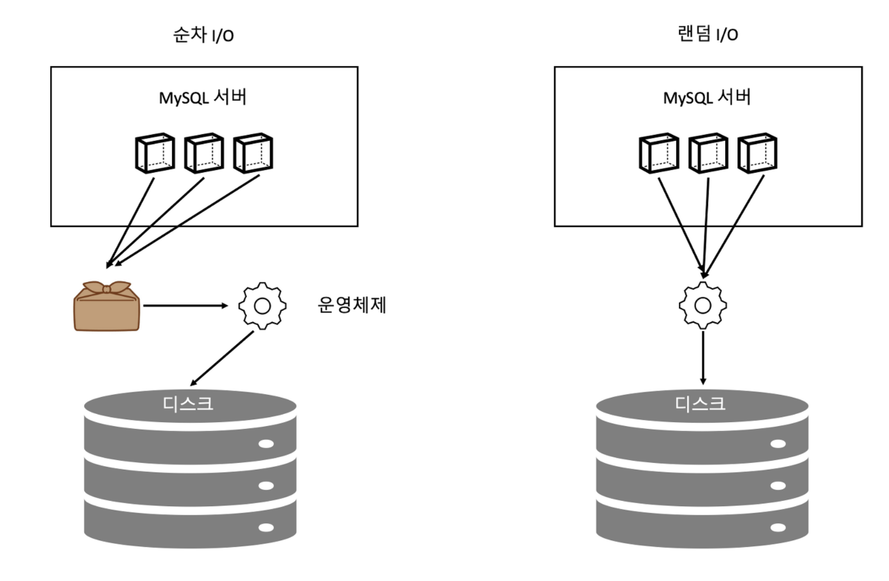

```
- 순차 I/O는 3개의 페이지를 기록하기 위해 1번 시스템 콜을 한다
- 랜덤 I/O는 3번 시스템 콜을 한다 이와같은 경우 3배 빠르다고 볼 수 있다
- 디스크의 성능은 헤더의 위치 이동없이 얼마나 많은 데이터를 한 번에 기록하느냐에 결정된다
- DB의 대부분 작업은 작은 데이터를 빈번히 읽고 쓰기 때문에 그룹 커밋이나 바이너리 로그 버퍼 등의 기능이 내장되어 있다
- 디스크 원판이 없는 SSD는 차이가 없을 것 같지만 실제로는 순차 I/O가 더 성능이 좋다
```

### 주의
- 쿼리를 튜닝해서 랜덤 I/O를 순차 I/O로 바꾸는 방법은 많지 않다
- 쿼리를 튜닝하는 것은 랜덤 I/O 자체를 줄여주는 것이 목적이라고 할 수 있다
- 여기서 랜덤 I/O를 줄인다는 건 쿼리를 처리하는 데 꼭 필요한 데이터만 읽도록 개선하는 것을 의미한다

>#### 참고
> - 인덱스 레인지 스캔은 주로 랜덤 I/O를 사용하며 
> - 풀 테이블 스캔은 순차 I/O를 사용한다
> - 그래서 큰 테이블의 레코드 대부분을 읽는 작업에서는 풀 테이블 스캔을 사용하도록 유도할 때도 있다
> - 웹 서비스보다는 데이터 웨어하우스나 통계 작업에서 자주 사용된다

## 2. 인덱스란
- 모든 데이터를 검색하기에는 시간이 오래 걸린다
- 해당 레코드와 저장된 주소를 키와 값으로 인덱스를 만들고 가장 중요한 정렬을 한다
  - 인덱스는 항상 정렬된 상태를 유지하고 데이터 파일은 저장된 순서대로 정렬 없이 저장해 둔다
- 역할로 구분한다면 프라이머리 키와 보조 키(세컨더리 인덱스)로 구분할 수 있다
- 저장 방식(알고리즘)별로 구분한다면 대표적으로 B-Tree 인덱스와 Hash 인덱스로 구분할 수 있다
  - B-Tree: 일반적으로 사용되는 알고리즘으로 값을 변경하지 않고 사용하는 인덱스이다. 위치 기반 검색을 위한 R-Tree 인덱스도 있지만 결국 B-Tree의 응용 알고리즘이다
  - Hash 인덱스: 칼럼값을 해시값을 계산해서 인덱싱하는 알고리즘으로 매우 빠른 검색을 지원한다. 하지만 값을 변형하므로 일부 또는 범위검색할 때는 해시를 쓸 수 없다
- 중복 허용 여부로 분류하면 유니크 인덱스와 유니크하지 않은 인덱스로 구분할 수 있다
  - 유니크 인덱스에 동등 조건으로 검색한다는 것은 하나만 찾으면 된다는 것을 옵티마이저에게 알려주는 효과를 낸다
- 기능별로 분류해보면 전문 검색용 인덱스나 공간 검색용 인덱스 등을 예로 들 수 있다

>#### 장단점
- 항상 정렬해야 하기 때문에 INSERT, UPDATE, DELETE 처리는 느리지만 SELECT는 매우 빠르게 처리할 수 있다
- 저장 속도를 어디까지 희생할 수 있을지 결정해야 한다

## 3. B-Tree 인덱스
- 가장 일반적으로 쓰이고, 가장 먼저 도입된 알고리즘이다
- 일반적으로 B+Tree 또는 B*Tree가 사용된다
- 값을 변형하지 않고 항상 정렬된 상태로 유지한다
- Binary(이진) 트리가 아니라 Balanced 트리이기 때문에 자식 노드가 여러 개이다

### 1). 구조 및 특성
- 트리구조로 루트노트 그 하위에 리프노드들이 존재한다
- 리프 노드는 데이터 레코드의 주솟값을 가지고 있다


>B-Tree 구조

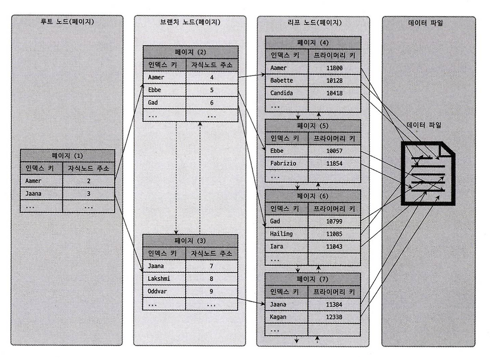

- 인덱스는 정렬되어 있지만 데이터파일은 정렬되어 있지 않다
- Insert만 한다면 순서대로 저장되겠지만 삭제하거나 변경하여 빈 공간이 생기면 공간을 재활용하도록 설계되어 있다
- 대부분 RDBMS는 임의의 순서로 저장되지만 InnoDB는 클러스터되어 프라이머리 키 순서로 정렬된다
  - 클러스터링: 비슷한 값을 최대한 모아서 저장하는 방식을 말한다

>### MyISAM과 InnoDB의 차이
- MyISAM: 모든 인데스가 물리적 주소가 있어 바로 데이터를 읽을 수 있다
- InnoDB: 세컨더리 키는 프라이머리 키의 주소가 적혀있어 두 번 조회를 해야한다
- InnoDB가 B-Tree를 한번 더 검색해서 성능이 떨어져보이지만 각각 장단점이 있다
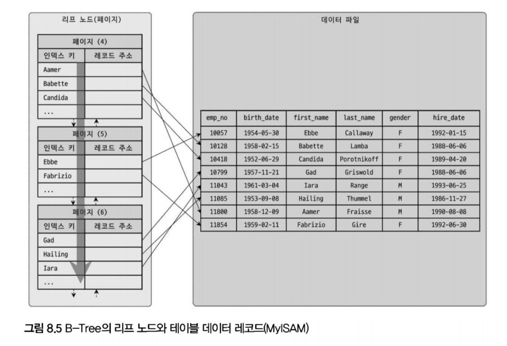
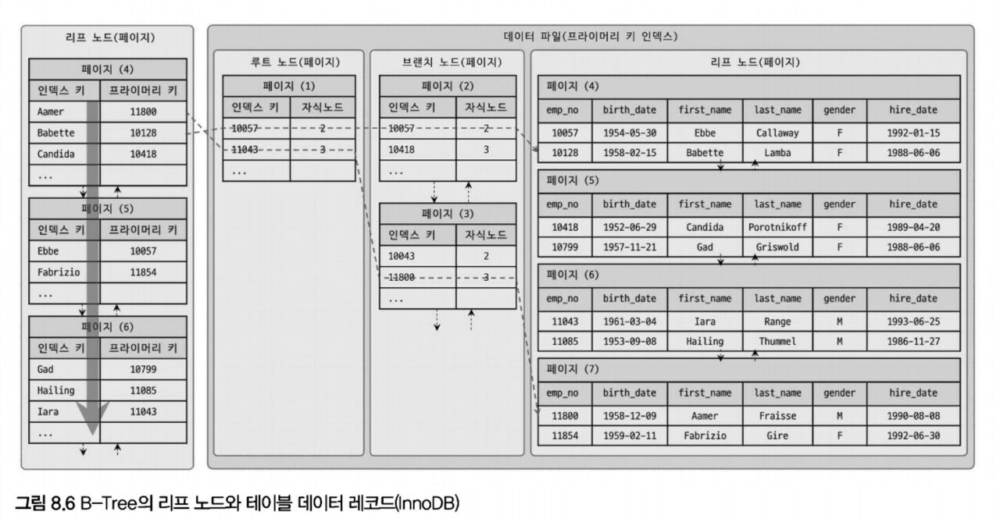

### 2). B-Tree 인덱스 키 추가 및 삭제

#### 1. 인덱스 키 추가
- 새로운 키 값이 스토리지 엔진에 따라 즉시 인덱스에 저장될 수도 있고 아닐수도 있다
- B-Tree에 저장될 때는 저장될 키 값을 이용해 B-Tree상 적절한 위치를 검색하고 해당 위치가 결정되면 레코드의 키 값과 대상 레코드의 주소 정보를 B-Tree의 리프노드에 저장한다
- 인덱스 비용을 예측하는 방법은 인덱스가 없을 경우는 작업 비용이 1이고, 3개인 경우에는 (1.5 * 3 + 1) 5.5로 예측한다
  - 이는 메모리와 CPU에서 처리하는 시간이 아니라 디스크로부터 인덱스 페이지를 읽고 쓰기를 해야 해서 걸리는 시간이다

#### 2. 인덱스 키 삭제
- 해당 키 값이 저장된 B-Tree의 리프노드를 찾앗거 삭제 마크만 하면 작업이 완료된다
- 마킹작업 또한 디스크 쓰기가 필요하므로 버퍼링 되어 지연 처리될 수 있다

#### 3. 인덱스 키 변경
- 인덱스 키 값은 값에 따라 위치가 결정되므로 삭제 후 다시 추가하는 형태로 처리된다
- 체인지 버퍼를 활용해 지연 처리 될 수 있다

#### 4. 인덱스 키 검색
- 추가비용을 감당하면서 인덱스를 구축하는 이유는 빠른 검색을 위해서이다
- 트리 탐색은 `SELECT`에서만 사용되는 것이 아니라 `UPDATE`, `DELETE`를 처리하기 위해 레코드를 검색할 경우에도 사용된다
- 검색은 100% 일치 또는 값의 앞부분만 일치하는 경우에 사용할 수 있다.
- 키 값 뒷부분 검색 또는 값이 변형하는 경우에는 인덱스를 사용할 수 없다
- InnoDB에서는 레코드락, 갭락 같은 경우는 인덱스를 잠근 후 수행하도록 되어있기 때문에 인덱스가 없다면 불필요하게 많은 레코드를 잠근다

### 3). B-Tree 인덱스 사용에 영향을 미치는 요소
- 인덱스 칼럼의 크기, 레코드의 건수, 유니크 인덱스 개수에 따라 검색이나 변경 작업의 성능이 영향을 받는다

#### 1. 인덱스 키 값 크기
- 디스크에 데이터를 저장하는 가장 기본 단위를 페이지 또는 블록이라고 하며 읽고 쓰기의 최소 작업 단위가 된다
- 인덱스도 페이지 단위로 관리된다
- B-Tree는 페이지 크기와 키 값 크기에 따라 자식 노드를 가변적으로 가진다
- `innodb_page_size`를 통해 페이지 크기를 변경할 수 있고 4KB ~ 64KB 사이를 선택할 수 있고 기본값은 16KB이다

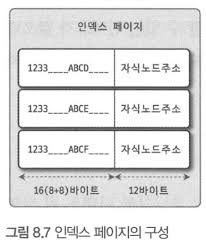

- 인덱스 페이지가 16KB이고 인덱스가 키가 16 바이트로 가정한다
- 자식노드 주소는 여러가지 복합적인 정보가 담긴 영역이며 6 ~ 12 바이트정도를 가진다
- 이럴 경우 하나의 인덱스 페이지에 16 * 1024 / (16 + 12 ) = 585개 가질 수 있다
- 최종적으로 자식노드를 585개 가지는 B-Tree가 되는것이고 인덱스 키 값이 32 바이트가 된다면 372개를 저장할 수 - 있기 때문에 Select 쿼리가 레코드 500개를 읽어야 한다면 최소 디스크를 2번 이상 읽어야 한다
- 인덱스 키 값의 길이가 길어진다는 것은 인덱스 크기가 커지므로 인덱스를 캐시해 두는 버퍼 풀에 저장도 제한되고 메모리 효율이 떨어지게 된다

#### 2. B-Tree 깊이
- 깊이는 상당히 중요하지만 직접 제어할 방법은 없다

> #### 키 값 평균이 클어나면 어떤 현상이 일어나는지 알아보자
- B-Tree 깊이가 3인 경우
  - 키 값이 16바이트 인 경우 585 * 585 * 585 = 2억정도 저장할 수 있다 (자식 노드를 최대 585개 가질 수 있음)
  - 32바이트로 늘어날 경우 372 * 372 * 372 = 5천만정도로 줄어든다
- 인덱스 키 값의 크기가 커질수록 페이지에 담을 수 있는 개수가 적어지고 B-Tree 깊이가 길어져서 디스크 읽기가 더 많이 필요하게 된다
- 아무리 대용량 데이터베이스라도 깊이가 5단계 이상까지 깊어지는 경우는 흔치 않다

#### 3. 선택도(기수성)
- 모든 인덱스 키 값 가운데 유니크한 값의 수를 의미한다
  - 인덱스 키 값이 100개이고, 그중에서 유니크한 값의 수는 10개라면 기구성은 10이다
- 중복된 값이 많아질수록 기수성은 낮아지고 선택도 또한 떨어진다
- 선택도가 높을수록 검색 대상이 줄어들기 때문에 그만큼 빠르게 처리된다

```SQL
# country 칼럼의 유니크 값이 10개일 때
SELECT * FROM tb_test WHERE country='KOREA' AND city = 'SEOUL';

유니크 값이 10개이므로 10개 국가(country)의 도시(city) 정보가 저장되어 있는 것이다
여기서 예측할 수 있다. 1만 건의 레코드를 가지고 있다고 했을 때 10,000 / 10 = 1,000건이 일치하고
1000건 가운데 city='SEOUL'인 레코드는 1건이므로 999건은 불필요하게 읽은 것이다

# country 칼럼의 유니크 값이 1,000개일 때
10,000 / 1,000 = 10건이 일치할 것이며 1건만 읽을것이므로 9건만 불필요하게 읽은 것이다
```

#### 4. 읽어야 하는 레코드의 건수
- 인덱스를 통한 읽기 > 인덱스를 거치지 않고 바로 읽기: 인덱스가 더 비용이 많이 든다
  - 인덱스를 통한 읽기가 직접 읽는 것보다 4~5배 정도 비용이 더 많이 드는 작업으로 예측한다
- 레코드가 100만 건이 있고 50만 건을 읽어야 할 때 테이블을 모두 읽어서 50만 건을 버릴지, 인덱스를 통해 50만 건을 읽는 것이 효율적일지 판단해야 한다
- 읽어야 할 레코드 건수가 20 ~ 25% 넘어서면 테이블을 모두 읽는 방식이 효율적이다

### 4). B-Tree 인덱스를 통한 데이터 읽기
- 어떤 경우에 인덱스를 사용하게 유도할지 아닐지를 판단하려면, 어떻게 인덱스를 이용해서 실제 레코드를 읽어 내는지 알아야 한다
- 인덱스를 이용하는 대표적인 세 가지가 있다

#### 1. 인덱스 레인지 스캔
- 가장 대표적인 접근 방식으로 나머지 두 가지보다 빠른 방법이다
- 인덱스를 통해 한 건만 읽는 경우와 한 건 이상을 읽는 경우는 다른 이름으로 구분하지만, 이번에는 모두 `인덱스 레인지 스캔`이라고 표현한다
- 인덱스 범위가 결정됐을 때 사용하는 방식이다


```SQL
- 스캔 시작 위치를 검색하고 그 지점부터 필요한 방향(오름차순, 내림차순)으로 인덱스를 읽어 나간다
- 한 가지 중요한 것은 리프 노드에서 검색 조건에 일치하는 건들을 데이터파일에서 읽어오는 과정이 필요하다
- 레코드 한 건 한 건 단위로 랜덤 I/O가 일어나기 때문에 3건의 레코드를 가져오기 위해 3번의 랜덤 I/O가 발생한다

1. 인덱스 탐색: 인덱스에서 조건을 만족하는 값이 저장된 위치를 찾는다
2. 인덱스 스캔: 1번에서 탐색된 위치부터 필요한 만큼 인덱스를 차례대로 쭉 읽는다
3. 2번에서 읽어 들인 인덱스 키와 레코드 주소를 이용해 레코드가 저장된 페이지를 가져오고, 최종 레코드를 읽어온다
- 커버링 인덱스의 경우 3번 과정이 필요하지 않을 수 있다. 디스크에 저장된 레코드를 읽지 않아도 되기 떄문에 랜덤 성능이 빠르다
- SHOW STATUS LIKE 'Handler_%'를 통해 1번과 2번작업이 얼마나 수행됐는지 확인할 수 있다
```

#### 2. 인덱스 풀 스캔
- 인덱스의 처음부터 끝까지 모두 읽는 방식이다
- 예를들어 인덱스는 (A, B, C) 순으로 되어 있지만 쿼리의 조건절은 B나 C 칼럼으로 검색하는 경우에 사용된다
- 일반적으로 인덱스 크기는 테이블보다 작으므로 `테이블 풀 스캔`보다는 효율적이고 쿼리가 인덱스에 명시된 칼럼만으로 조건을 처리할 수 있는 경우에 주로 사용된다


> #### 주의
- 인덱스를 사용한다는 것은 `인덱스 레인지 스캔`이나 `루스 인덱스 스캔`을 사용하는 것을 의미한다
- 인덱스 풀 스캔은 효율적인 방식이 아니며, 인덱스를 생성하는 목적이 아니다
- 인덱스 풀 스캔 방식을 사용하는 경우는 인덱스를 사용하지 못한다 또는 인덱스를 효율적으로 사용하지 못한다라는 표현을 사용한다

#### 3. 루스 인덱스 스캔
- 앞에 있는 두 가지 방법은 상반된 의미로 타이트 인덱스 스캔으로 분류한다
- 말 그대로 느슨하게 인덱스를 읽는 것을 의미한다
- 레인지 스캔과 비슷하게 작동하지만 필요하지 않은 인덱스는 무시하고 넘어가는 형태로 처리된다
- 일반적으로 GROUP BY 또는 집합 함수 중 MIN, MAX 함수에 최적화 하는 경우에 사용된다

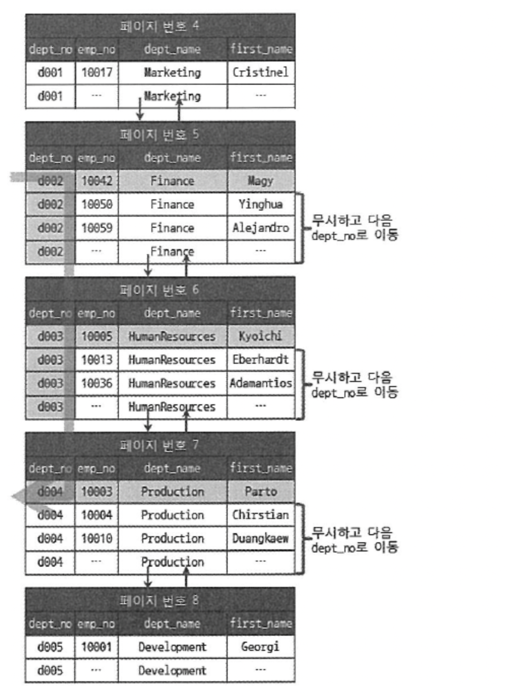

```SQL
# dept_no와 emp_no 두 개의 칼럼으로 인덱스가 생성돼 있다
# (dept_no, emp_no) 조합으로 정렬되어 있어 dept_no 그룹별로 emp_no 값만 읽으면 된다
# 즉 WHERE 조건을 만족하는 범위 전체를 스캔할 필요가 없다는 것을 옵티마이저도 알고 있기 때문에
# 조건에 만족하지 않는 레코드는 무시하고 다음 레코드로 이동한다
SELECT dept_no, MIN(emp_no)
FROM dept_emp
WHERE dep_no BETWEEN 'd002' AND 'd004'
GROUP BY dept_no;
```

#### 4. 인덱스 스킵 스캔
- 인덱스의 핵심은 정렬되어 있는 것이며 이로 인해 인덱스를 구성하는 칼럼의 순서가 매우 중요하다
- 하지만 8.0부터는 순서도 예전만큼 중요하게 여겨지지는 않는다
- 새로 도입된 기능이어서 다음과 같은 단점이 있다
  - 선행 카럼의 유니크한 값의 개수가 적어야 한다
  - 쿼리가 인덱스에 존재하는 칼럼으로 처리 가능해야 한다 (커버링 인덱스)
- 유니크한 값의 개수가 많다면 검색작업이 많이 필요해지므로 오히려 더 느려질 수도 있다

```SQL
ADD INDEX (gender, birth_date)
# 인덱스를 사용하지 못하는 쿼리
SELECT * FROM employees WHERE birth_date >= '1965-02-01';

# 인덱스를 사용할 수 있는 쿼리
SELECT * FROM employees WHERE gender = 'M' AND birth_date >= '1965-02-01'

- 기존에는 위에 적힌 대로 birth_date칼럼으로 인덱스를 사용하기 위해서는 새로 생성했어야 했다
- 8.0부터는 gender 칼럼을 건너뛰어서 birth_date 칼럼만으로 인덱스 검색이 가능하게 해주는 기능이 도입됐다
- 기존에는 인덱스 풀 스캔으로 작동했지만 인덱스 스킵 스캔이 사용된다면 실행 계획이 range로 표시된다
- gender 칼럼에서 유니크한 값을 모두 조회해 칼럼 조건을 추가해서 쿼리를 다시 실행하는 형태로 처리된다

아래와 비슷한 형태로 최적화를 실행하게 된다
SELECT gender, birth_date FROM employees WHERE gender="M" AND birth_date >= '1965-02-01';
SELECT gender, birth_date FROM employees WHERE gender="F" AND birth_date >= '1965-02-01';
```


### 5). 다중 칼럼 인덱스
- 다중 칼럼 인덱스(복합 칼럼 인덱스): 두 개 이상의 칼럼으로 구성된 인덱스를 의미한다
- 두 번쨰 칼럼은 첫 번쨰 칼럼에 의존해서 정렬되어 있다
  - 이처럼 그 다음 칼럼은 앞선 칼럼에 의존해서 정렬이 된다
- 다중 칼럼 인덱스는 위치가 상당히 중요하게 신중히 결정해야 한다


### 6). B-Tree 인덱스의 정렬 및 스캔 방향
- 인덱스 키 값은 항상 오름차순이거나 내림차순으로 정렬되어 저장된다
- 하지만 오름차순으로 생성됐다고 해서 해당 순서대로 읽는 것이 아니고 거꾸로 읽으면 내림차순으로 정렬된 것처럼 사용할 수 있다
- 이는 옵티마이저가 실시간으로 만드는 실행 계획에 따라 결정된다

#### 1. 인덱스 정렬
- 8.0부터 정렬 순서를 혼합한 인덱스도 생성할 수 있게 됐다
  - `CREATE INDEX (team_name ASC, user_score DESC);`

##### 1). 인덱스 스캔 방향
`SELECT * FROM employees ORDER BY first_name DESC LIMIT 1`
- 옵티마이저는 오름차순, 내림차순을 판단해서 가져올 수 있다
  - 인덱스가 오름차순으로 생성되었더라도 전부다 읽어서 가져오는 게 아니라 내림차순으로 읽어서 바로 하나만 가져오도록 한다
- 쿼리의 ORDER BY 처리나 MIN 또는 MAX 등의 최적화가 필요한 경우에도 옵티마이저는 읽기 방향을 전환해서 사용하도록 실행 계획을 만들어 낸다

##### 2). 내림차순 인덱스
- 오름차순 인덱스: 작은 값의 인덱스가 왼쪽으로 정렬된 인덱스
- 내림차순 인덱스: 큰 값의 엔덱스가 왼쪽으로 정렬된 인덱스
- 아래와 같이 역순 정렬 쿼리가 1.2초 (28.9%) 더 시간이 걸리는 것을 확인할 수 있다
- `DESC`가 드물게 실행되는 겨우라면 내림차순 인덱스를 굳이 고려할 필요는 없다

```sql
-- 프라이머리 키로 정렬하고 모든 값을 스캔하기 위해 LIMIT OFFSET를 사용했다
SELECT * FROM t1 ORDER BY tid ASC LIMIT 12619775 1;
-- (4. 15 sec)
SELECT * FROM t1 ORDER BY tid DESC LIMIT 12619775 1;
-- (5.35)sec
```

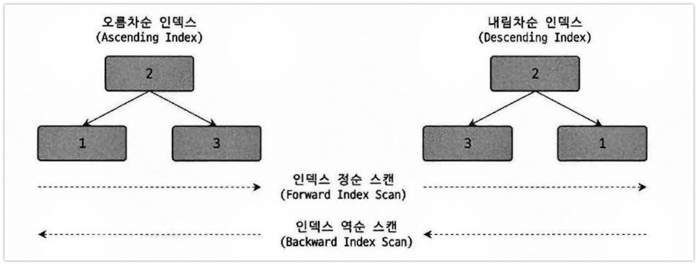

##### 인덱스 역순 스캔은 정순보다 느릴 수 밖에 없는 두 가지 이유가 있다
- 페이지 잠금이 인덱스 정순 스캔에 적합한 구조이다
- 페이지 내에서 인덱스 레코드는 단방향으로만 연결된 구조이다

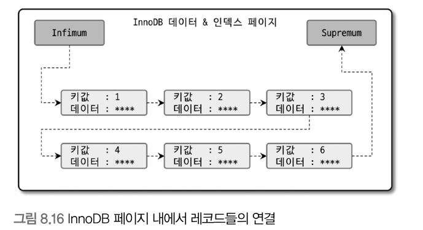

> ##### 주의
- `SELECT * FROM employees ORDER BY team_name ASC, user_score DESC LIMIT 10`
- 2개 이상의 칼럼이 내림차순, 오름차순을 동시에 사용하는 경우에는 옵티마이저도 인덱스를 제대로 사용하지 못한다
- `CREATE INDEX (team_name ASC, user_score DESC)`를 생성해야 된다

### 7). B-Tree 인덱스의 가용성과 효율성
- 어떤 경우에 인덱스를 사용할 수 있고, 어떤 방식으로 사용할 수 있는지 식별해야 한다

#### 1. 비교 조건의 종류와 효율성
- 동등 비교인지 범위 조건(<, >)인지에 따라 인덱스 활용 형태와 효율 또한 달라진다
- 작업 범위를 결정하는 조건은 많을수록 쿼리 처리 성능을 높이지만 체크 조건은 많다고 해서 처리 성능을 높이지는 못한다
  - 오히려 쿼리 실행을 더 느리게 만들 때가 있다

```sql
-- 두 가지 케이스 인덱스가 있을 때 어떤 차이가 있을까
-- CASE A: INDEX(dept_no, emp_no)
-- CASE B: INDEX(emp_no, dept_no)
SELECT * FROM dept_emp
WHERE dtp_no = 'd002' AND emp_no >= 10114;

-- CASE A처럼 작업 범위를 결정하는 조건을 작업 범위 결정 조건이라고 한다
-- CASE B처럼 비교 작업의 범위를 줄이지 못하고 필터링만 하는 것을 필터링 조건 또는 체크 조건이라고 한다
```

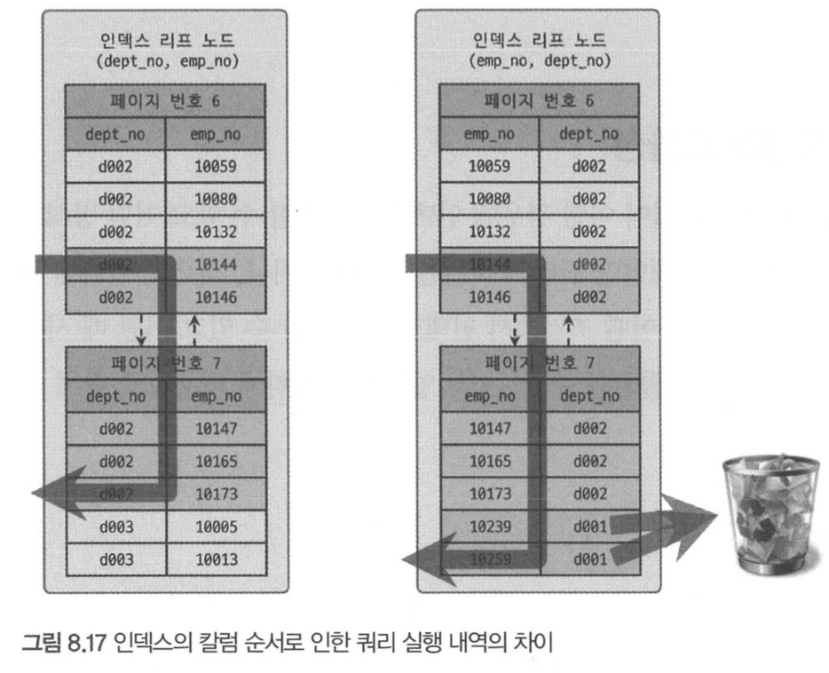

#### 2. 인덱스 가용성
- B-Tree 인덱스 특징은 왼쪽 값에 기준해서 오른쪽 값이 정렬되어 있다는 뜻이다
  - 예를 들어 `INDEX (dept_no, emp_no)`의 경우 왼쪽 칼럼 값을 모르고 인덱스 레인지 스캔도 불가능하고 왼쪽 값 이후 오른쪽 값이 정렬된다
  - `LIKE %mer' 같은 경우도 왼쪽 기준 정렬인 B-Tree에서는 인덱스 효과를 얻을 수 없다


#### 3. 가용성과 효율성 판단
- B-Tree 인덱스 특성상 다음 조건에서는 사용할 수 없다
  - 작범 범위 결정 조건으로 사용할 수 없다는 것이며, 경우에 따라서는 체크 조건으로는 사용할 수 있다
- NULL 값도 인덱스에 저장되어 작업 범위 결정 조건으로 사용된다

> ##### 단일 컬럼 인덱스
1. Not-Euqal로 비교된 경우
    - <>, NOT IN, NOT BETWEEN, IS NOT NULL
2. LIKE '%??': 앞부분이 아닌 뒷부분일치
3. 스토어드 함수나 다른 연산자로 인덱스 칼럼이 변형된 후 비교된 경우
    - WHERE SUBSTREING(column,1 ,1) = 'X'
4. NOT-DETERMINISTIC 속성의 스토어드 함수가 비교 조건에 사용된 경우
    - WHERE column = deterministic_function()
5. 데이터 타입이 서로 다른 비교
    - WHERE char_column = 10
6. 문자열 데이터 타입의 콜레이션이 다른 경우

> ##### 다중 컬럼 인덱스
- `INDEX ix_test (column_1, column_2, ..., column_n)`
1. 작업 범위 결정 조건으로 인덱스를 사용하지 못하는 경우
    - column_1 칼럼에 대한 조건이 없는 경우
    - column_1 칼럼의 비교 조건이 단일 컬럼 인덱스 사용 불가 조건 중 하나인 경우
2. 작업 범위 결정 조건으로 인덱스를 사용하는 경우
    - column_1 ~ n까지 동등 비교 형태(= 또는 IN)
    - column_i칼럼이 동등 비교 또는 범위 비교, LIKE로 좌측 일치 패턴

## 4. R-Tree 인덱스
- MySQL의 공간 인덱스로 2차원 데이터를 인덱싱하고 검색하는 목적의 인덱스이다
- 내부 매커니즘은 B-Tree와 흡사하다
- MySQL의 공간 확장을 이용하면 위치 기반 서비스를 구현할 수 있고 크게 세가지 기능이 포함돼 있다
  - 공간 데이터를 저장할 수 있는 데이터 타입
  - 공간 데이터의 검색을 위한 공간 인덱스
  - 공간 데이터의 연산 함수

### 1. 구조 및 특성
- 공간 정보 저장 및 검색을 위해 여러 가지 기하하적 도형정보를 관리할 수 있는 데이터 타입을 제공한다
- `GEOMETRY` 타입은 슈퍼 타입으로 앞선 세 가지 객체를 모두 저장할 수 있다
- R-Tree 알고리즘을 이해하려면 MBR(Minimum Bounding Rectangle)을 알고 있어야 하는데 이는 도형을 감싸는 최소 크기의 사각형을 의미한다
  - 이 사각형들의 포함 관계를 B-Tree 형태로 구현한 인덱스가 R-Tree 인덱스다


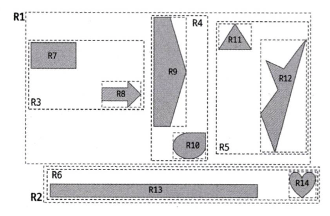

### 2. R-Tree 인덱스 용도
- MBR 정보를 이용해 B-Tree 형태로 인덱스를 구축하므로 Rectangle의 R을 섞어 R-Tree이며 공간 인덱스라고도 한다
- 일반적으로 GPS 기준의 위도, 경도 좌표 저장에 주로 사용된다
  - 위도 경도뿐만 아니라 CAD/CAM 소프트웨어 또는 회로 디자인 등과 같은 좌표 시스템에 기반을 둔 정보에 모두 적용할 수 있다
- 도형의 포함관게를 이용해 만들어진 인덱스로 `ST_Contains()` 또는 `ST_Within()`등과 같은 함수로 검색을 수행하는 경우에만 인덱스를 이용할 수 있다
  - 거리를 비교하는 `ST_Distance()` 등과 같은 함수는 효율적으로 사용하지 못한다

## 5. 전문 검색 인덱스
- 문서 전체를 인덱스화해서 특정 키워드가 포함된 문서를 검색하는 전문 검색에는 B-Tree 인덱스를 사용할 수 없다

### 1). 인덱스 알고리즘
- 키워드를 분석하고 빠른 검색용으로 사용할 수 있도록 키워드로 인덱스를 구축한다
- 키워드를 인덱싱하는 기법에 따라 `단어의 어근 분석`과 `n-gram`분석 알고리즘으로 구분할 수 있다

#### 1. 어근 분석 알고리즘
- 전문 검색 인덱스는 두 가지 과정을 거쳐 색인 작업이 수행된다
  - 불용어(Stop Word) 처리: 가치가 없는 단어를 필터링해서 제거하는 작업이다
    - MySQL 서버에 불용어가 정의되어 있지만 사용자가 별도로 불용어를 정의할 수도 있다
  - 어근 분석(Stemming): 검색어로 선정된 단어의 뿌리인 원형을 찾는 작업이다
    - MeCab을 플러그인 형태로 사용할 수 있다 하지만 언어를 학습하는 과정이 필요해 많은 시간과 노력이 필요하다

#### 2. n-gram 알고리즘
- `MeCab`은 매우 전문적인 전문 검색 알고리즘이라 만족할만한 결과를 내기 위해 많은 노력과 시간이 필요하다
- 이런 단점을 보완하기 위해 `n-gram`알고리즘이 도입된 것이다
- 형태소 분석이 문장을 이해하는 알고리즘이라면 n-gram은 단순히 키워드를 검색해내기 위한 인덱싱 알고리즘이다

>##### 방법
- 본문을 무조건 몇 글자씩 잘라서 인덱싱하는 방법이다.
  - 국가별 언어에 대한 이해와 준비 작업이 필요없지만 인덱스 크기는 상당히 큰 편이다
- `n-gram`의 n은 인덱싱할 키워드의 최소 글자 수르르 의미하는데 2글자 단위로 키워드를 쪼개는 2-gram 방식이 많이 사용된다

```
To be or not to be. That is the question
위의 문장은 띄어쓰기와 마침표를 기준으로 10개의 단어로 구분되고, 2글자씩 중첩해서 토큰으로 분리된다
그래서 10글자 단어라면 2-gram 알고리즘에서는 (10-1)개의 토큰으로 구분된다 예) ab,bc,cd,...
이렇게 생성된 토큰들에 대해 불용어를 걸러내는 작업을 수행한다
전문 검색을 빠르게 하기 위해 2단계 인덱싱도 있지만 구분된 토큰을 B-Tree 인덱스에 저장한다
```
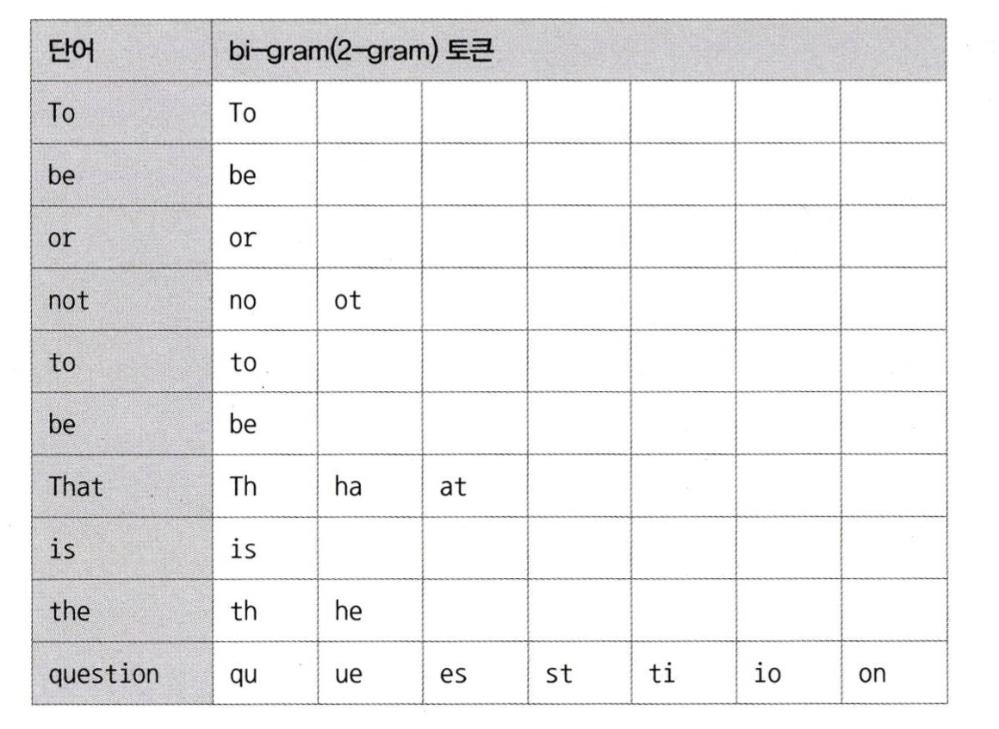

#### 3. 불용어 변경 및 삭제
- 불용어 처리는 사용자에게 도움이 되기보다는 사용자를 더 혼란스럽게 할 수도 있다.
- 불용어 처리 자체를 완전히 무시하거나 사용자가 직접 불용어를 등록하는 방법을 권장한다

##### 1). 전문 검색 인덱스의 불용어 처리 무시
- 불용어 처리를 무시하는 방법은 두 가지가 있다
  - `my.cnf` 파일의 `ft_stopword_file` 시스템 변수에 빈 문자열을 설정하여 MySQL 서버의 모든 전문 검색 인덱스에 대해 불용어를 완전히 제거한다
    - `ft_stopword_file`은 불용어로 비활성화에도 사용할 수 있지만 불용어 목록을 저장한 파일의 경로를 지정하면 사용자 정의 불용어를 적용할 때도 사용할 수 있다
  - `innodb_ft_enable_stopword` 시스템 변수를 OFF로 하면 InnoDB 테이블의 전문 검색 불용어 처리를 무시한다

##### 2). 사용자 정의 불용어 사용
1. 불용어 목록을 파일로 저장하고 파일 경로를 지정한다
    - `ft_stopword_file='/data/my_custom_stopword.txt`
2. 불용어 목록을 테이블로 저장하고 `innodb_ft_server_stopword_table`에 불용어 테이블을 설정한다
    - `SET GLOBAL innodb_ft_server_stopword_table='mydb/my_stopword`

### 2. 전문 검색 인덱스의 가용성
- 전문 검색 인덱스를 사용하려면 반드시 다음 두 가지 조건을 갖춰야 한다
  - 쿼리 문장이 전문 검색을 위한 문법(MATCH ... AGAINST ...)을 사용
  - 테이블이 전문 검색 대상 칼럼에 대해서 전문 인덱스 보유

```sql
CREATE TABLE tb_test(
  doc_id INT
  doc_body TEXT
  FULLTEXT KEY fx_docbody (doc_body) WITH PARSER ngram
)

-- 아래와 같은 검색 쿼리로도 원하는 결과를 얻을 순 있지만 풀 테이블 스캔으로 처리한다
SELECT * FROM tb_test WHERE doc_body LIKE '%애플%';

-- 전문 검색 인덱스를 사용하려면 특정 구문으로 검색쿼리를 작성해야 한다
-- 전문 검색 인덱스를 구성하는 칼럼들은 MATCH절의 괄호 안에 모두 명시돼야 한다
SELECT * FROM tb_test WHERE MATCH(doc_body) AGAINST('애플' IN BOOLEAN MODE);
```

## 6. 함수 기반 인덱스
- 일반적인 인덱스는 칼럼 값 앞부분 또는 전체에 대해서만 인덱스 생성이 허용된다
- 하지만 가끔은 값을 변형해서 만들어진 값에 대해 인덱스를 구축할 때도 있는데 이 경우 함수 기반 인덱스를 활용하면 된다
- 내부적인 구조 및 유지관리 방법은 B-Tree 인덱스와 동일하다
- 함수 기반 인덱스를 구현하는 방법은 두 가지로 구분할 수 있다
  - 가상 칼럼을 이용한 인덱스
  - 함수를 이용한 인덱스

### 1. 가상 칼럼을 이용한 인덱스
```sql
-- first_name과 last_name을 합쳐서 검색해야 하는 요건이 생겼다면 가상 칼럼을 추가하면 된다
-- VIRUTAL이나 STORED 옵션 중 상관없이 인덱스를 생성할 수 있다
ALTER TABLE user
ADD full_name VARCHAR(30) AS (CONCAT(first_name, ' ', last_name)) VIRTUAL,
ADD INDEX ix_fullname (full_name);
```

### 2. 함수를 이용한 인덱스
- 테이블 구조는 변경하지 않고 인덱스를 만들어준다
- 제대로 활용하려면 명시된 표현식이 그대로 사용돼야 한다
  - 사용된 표현식이 다르다면(결과가 같더라도) 옵티마이저는 다른 포현식으로 간주해서 인덱스를 사용하지 못한다
```sql
CREATE TABLE user(
  first_name VARCHAR(10)
  last_name VARCHAR(10),
  INDEX ix_fullname ((CONCAT(first_name, ' ' , last_name)))
)
```

## 7. 멀티 밸류 인덱스
- 여러 개의 키 값을 가질 수 있는 형태의 인덱스이다
- 정규화에 위배되는 형태지만 JSON 데이터 타입을 지원하기 시작하면서 필요하게 됐다
- 이제 MongoDB에 비해서도 부족함이 없는 상태가 됐다
- 일반적인 조건 방식을 사용하면 안되고 다음 함수들을 이용해서 검색해야 인덱스를 활용한다
  - MEMBER OF()
  - JSON_CONTAINS()
  - JSON_VERLAPS()

```sql
CREATE TABLE user(
  credit_info JSON,
  INDEX my_creditscores ((CAST(credit_info -> '$.credit.scores' AS UNISNGED ARRAY)))
)
INSERT INTO user VALUES ('{"credit_scores": [360, 353, 351]}')

SELECT * FROM user WHERE 360 MEMBER OF(credit_info -> '$.credit_scores');
```

## 8. 클러스터링 인덱스
- 테이블의 레코드를 비슷한 것(프라이머리 키 기준)들끼리 묶어서 저장되는 형태로 구현된다
- InnoDB 스토리지 엔진에서만 지원한다

### 1. 클러스터링 인덱스
- 테이블의 프라이머리 키에 대해서만 적용되는 내용이다
- 프라이머리 키 값에 의해 레코드의 저장 위치가 결정된다
- 즉 프라이머리 키 값이 변경된다면 레코드의 물리적인 저장 위치가 바뀌어야 한다
- 프라이머리 키 값으로 클러스터링된 테이블은 의존도가 굉장히 크기 때문에 신중히 프라이머리 키를 결정해야 한다
- 프라이머리 키 값에 의해 레코드의 저장 위치가 결정되므로 인덱스 알고리즘이라기보다 테이블 레코드의 저장 방식이라고 볼 수 있다
- InnoDB와 같이 항상 클러스터링 인덱스로 저장되는 테이블은 프라이머리 키 기반의 검색이 매우 빠르며, 대신 레코드의 저장이나 프라이머리 키의 변경이 상대적으로 느리다

>##### 주의
- B-Tree도 인덱스 키 값으로 정렬되기 때문에 인덱스 키 값으로 클러스터링된 것으로 생각할 수 있다
- 하지만 프라이머리 키 값으로 정렬되어 저장된 경우만 `클러스터링 인덱스`라고 부른다

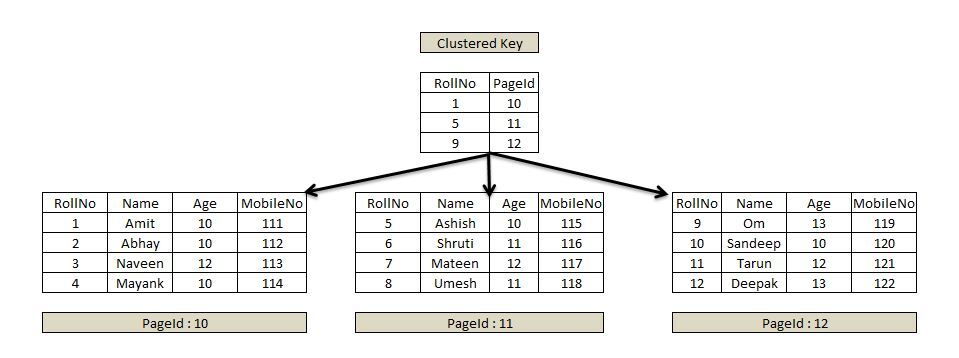

>##### 구조
- B-Tree와 비슷하지만 리프 노드에는 레코드의 모든 칼럼이 같이 저장돼 있다
- 클러스터링 테이블은 그 자체가 하나의 거대한 인덱스 구조로 관리되는 것이다
- 프라이머리 키가 없는 경우에는 다음 우선순위 대로 프라이머리 키를 대체할 칼럼을 선택한다
  - 프라이머리 키가 있다면 기본적으로 프라이머리 키를 클러스터링 키로 선택
  - NOT NULL 옵션의 유니크 인덱스중에서 첫 번째 인덱스를 선택
  - 자동으로 유니크한 값을 가지도록 증가되는 칼럼을 내부적으로 추가한 후 선택
- 적절한 클러스터링 키 후보를 찾지 못하는 경우 내부적으로 레코드의 일련번호 칼럼을 생성한다
- 이렇게 추가된 프라이머리 키(일련번호 칼럼)는 사용자에게 노출되지 않으며 쿼리 문장에 명시적으로 사용할 수 없다

### 2. 세컨더리 인덱스에 미치는 영향
- MyISAM이나 MEMORY 테이블같이 클러스터링되지 않는 테이블은 처음 INSERT된 공간에서 절대 이동하지 않고 ROWID를 이용해 실제 데이터를 찾아와 프라이머리 키와 세컨더리 인덱스는 구조적으로 아무런 차이가 없다
- InnoDB에서는 이동하기 때문에 세컨더리 인덱스는 프라이머리 키 값을 저장하도록 구현돼 있다

### 3. 클러스터링 인덱스의 장점과 단점
- 장점
  - 프라이머리 키로 검색할 때 처리 성능이 매우 빠르다 (특히 범위 검색 시)
  - 세컨더리 인덱스가 프라이머리 키를 가지고 있기 때문에 인덱스만으로 처리될 수 있는 경우가 많다(커버링 인덱스)
- 단점
  - 클러스터링 키 값의 크기가 클수록 전체적으로 인덱스의 크기가 커진다
  - 세컨더리 인덱스로 검색할 경우 프라이머리 키로 다시 한번 검색해야 하므로 처리 성능이 느리다
  - INSERT할 때 프라이머리 키에 의해 레코드의 저장 위치가 결정되기 때문에 처리 성능이 느리다
  - 프라이머리 키를 변경할 때 레코드를 DELETE하고 INSERT하는 작업이 필요하기 때문에 처리 성능이 느리다
- 일반적인 웹 서비스는 쓰기와 읽기 비율이 2:8 정도이기 때문에 읽기를 빠르게 유지하는 것이 매우 중요하다

### 4. 클러스터링 테이블 사용 시 주의사항
#### 1). 클러스터링 인덱스 키의 크기
- 모든 세컨더리 인덱스에 프라이머리 키 값을 포함한다
- 프라이머리 키의 크기가 커지면 세컨더리 인덱스도 자동으로 크기가 커진다
- 40바이트 차이일 경우에도 레코드 건수가 1000만건이 되면 1.9GB나 증가한다

#### 2). 프라이머리 키는 AUTO-INCREMENT보다는 업무적인 칼럼으로 생성(가능한 경우)
- 프라이머리 키는 대부분 검색에서 상당히 빈번하게 사용되는 것이 입란적이다
- 그 칼럼의 크기가 크더라도 업무적으로 해당 레코드를 대표할 수 있다면 그 칼럼을 프라이머리 키로 설정하는 것이 좋다

#### 3). 프라이머리 키는 반드시 명시할 것
- 가능하면 AUTO_INCREMENT 칼럼을 이용해서라도 프라이머리 키는 생성하는 것을 권장한다
- 프라이머리 키를 정의하지 않으면 내부적으로 일련번호 칼럼을 추가하지만 사용자가 전혀 사욯라 수 없다
- 결국 AUTO_INCREMENT와 똑같지만 사용하지 못하고, ROW 기반의 복제나 InnoDB Cluster에서는 정상적인 복제 성능을 보장하지 못한다

#### 4). AUTO-INCREMENT 칼럼을 인조 식별자로 사용한 경우
- 여러 개의 칼럼이 복합으로 프라이머리 키가 만들어진 경우 크기가 길어질 때가 있다
- 프라이머리 키의 크기가 길어도 세컨더리가 인덱스가 필요하지 않다면 그대로 사용하는 것이 좋다
- 하지만 세컨더리 인덱스도 필요하고 프라이머리 키의 크기도 길다면 AUTO_INCREMENT 칼럼을 추가하고 이를 프라이머리 키로 추가하는 것이다
- 로그 테이블과 같이 INSERT 위주의 테이블은 AUTO_INCREMENT를 이용하는 것이 성능 향상에 도움이 된다

## 9. 유니크 인덱스
- 유니크는 인덱스보다는 제약 조건에 가깝다고 볼 수 있다
- InnoDB의 프라이머리 키는 클러스터링 키의 역할도 하므로 유니크 인덱스와는 근본적으로 다르다

### 1. 유니크 인덱스와 일반 세컨더리 인덱스의 비교
- 유니크 인덱스와 일반 세컨더리 인덱스는 구조상 아무런 차이점이 없다

#### 1). 인덱스 읽기
- 사실 유니크 인덱스는 빠르지 않고 거의 차이가 없다
- 읽어야 할 레코드가 많아 느린 것이지, 인덱스 자체의 특성 떄문에 느린 것이 아니다
  - 레코드 1건을 읽는 데 0.1초가 걸렸고 2건을 읽을 때 0.2초가 걸렷다고 했을 때 후자가 느리게 처리됐다고 할 수 없는 것과 같은 이치이다
- 읽어야 할 레코드 건수가 같다면 성능상의 차이는 미미하다

#### 2). 인덱스 쓰기
- 유니크 인덱스의 키 값을 쓸 때는 중복된 값이 있는지 체크하는 과정이 더 필요하다
- 중복된 값을 체크할 때 읽기 잠금을 하고, 쓰기를 할 때 쓰기 잠금을 하는데 이 과정에서 데드락이 아주 빈번히 발생한다
- 인덱스 키 저장을 버퍼링하기 위해 체인지 버퍼가 사용되지만 유니크 인덱스는 중복 체크를 해야 하므로 버퍼링을 하지 못한다

### 2. 유니크 인덱스 사용 시 주의사항
- 필요한 경우 유니크 인덱스를 생성하는 것은 당연하지만, 성능이 더 좋아질 것으로 생각하고 생성하지 않는 것이 좋다
- 유니크 인덱스는 일반 다른 인덱스와 같은 역할을 하므로 중복해서 인덱스를 생성할 필요는 없다
- 유일성이 꼭 보장돼야 하는 칼럼에 대해서는 유니크 인덱스를 생성하되, 꼭 필요하지 않다면 유니크 인덱스보다는 세컨더리 인덱스를 생성하는 방법을 고려해 보는 것이 좋다

## 10. 외래키
- InnoDB에서만 생성할 수 있으면 외래키 제약이 설정되면 자동으로 연관되는 테이블 칼럼에 인덱스까지 생성된다
- 외래키가 제거되지 않은 상태에서 자동으로 생성된 인덱스를 삭제할 수 없다
- 외래키 관리에는 두 가지 특징이 있다
  - 테이블의 변경(쓰기 잠금)이 발생하는 경우에만 잠금 경합(잠금 대기)이 발생한다
  - 외래키와 연관되지 않은 칼럼의 변경은 최대한 잠금 경합(잠금 대기)을 발생시키지 않는다

### 1. 자식 테이블의 변경이 대기하는 경우
1. 1번 트랜잭션에서 부모 테이블에서 UPDATE를 실행하고 쓰기 잠금을 획득한다
2. 2번 트랜잭션에서 자식 테이블이 외래키 칼럼을 변경한다
  - 해당 쿼리는 부모 테이블 변경 작업이 완료될 때까지 대기한다
3. 1번 트랜잭션이 종료되면 2번 트랜직션이 처리가 된다
4. 자식의 외래키 칼럼 변경(INSERT, UPDATE)는 부모 테이블의 확인이 필요한데, 해당 레코드가 쓰기 자금이 걸려있다면 해제될 때까지 기다리게 된다
5. 자식 테이블의 외래키가 아닌 칼럼의 변경은 위와 같은 현상이 발생하지 않는다

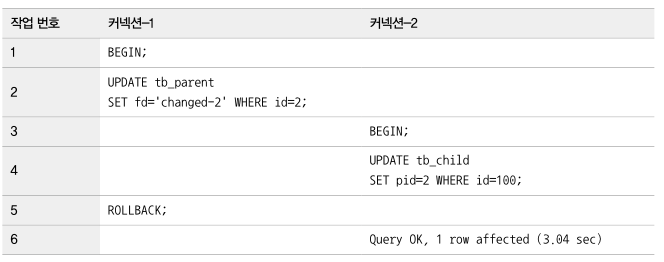

### 2. 부모 테이블의 변경 작업이 대기하는 경우
1. 1번 트랜잭션에서 부모 키 `1`을 참조하는 자식 테이블의 레코드를 변경하면 쓰기 잠금을 획득한다
2. 2번 트랜잭션에서 id가 `1`인 레코드르 삭제하는 경우 쓰기 잠금이 해제될 때까지 기다려야 한다
3. 자식 테이블이 생성될 때 정의된 외래키 특성(ON DELETE CASCADE) 때문에 부모 레코드가 삭제되면 자식 레코드도 동시에 삭제되는 식으로 작동하기 때문이다

- 외래 키를 물리적으로 생성하려면 이러한 현상으로 인한 잠금 경합까지 고려해 모델링을 진행하는 것이 좋다
- 외래키를 생성하면 자식 테이블에 레코드가 추가되는 경우 해당 참조키가 부모 테이블에 있는지 확인한다
- 외래키 고려사항은 체크 작업이 아니라 체크를 위해 연관 테이블에 읽기 잠금을 걸어야 한다는 것이다
- 이렇게 잠금이 다른 테이블로 확장되면 그만큼 전체적으로 쿼리의 동시 처리에 영향을 미친다

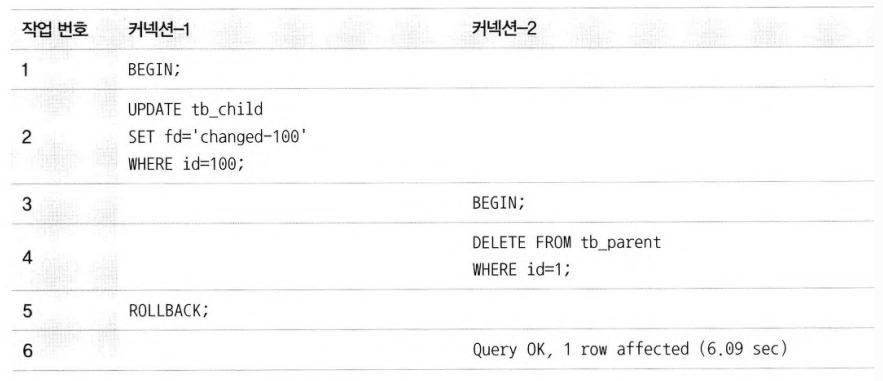