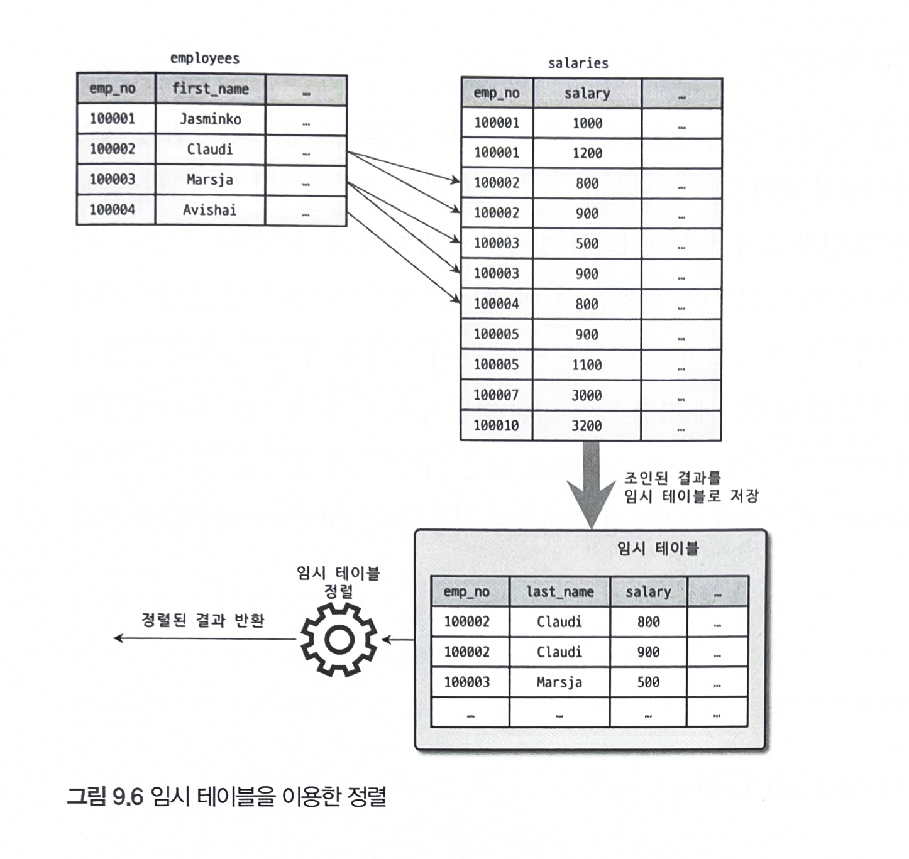
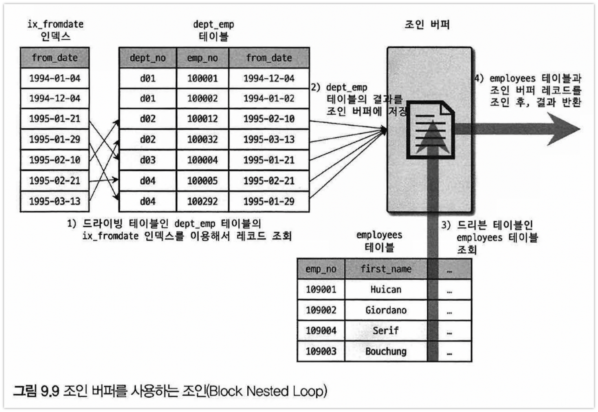
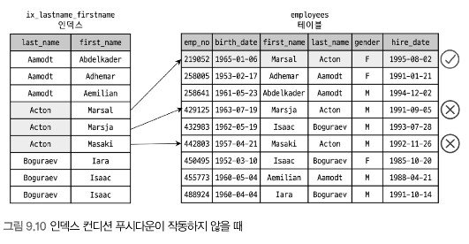
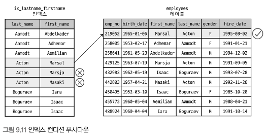
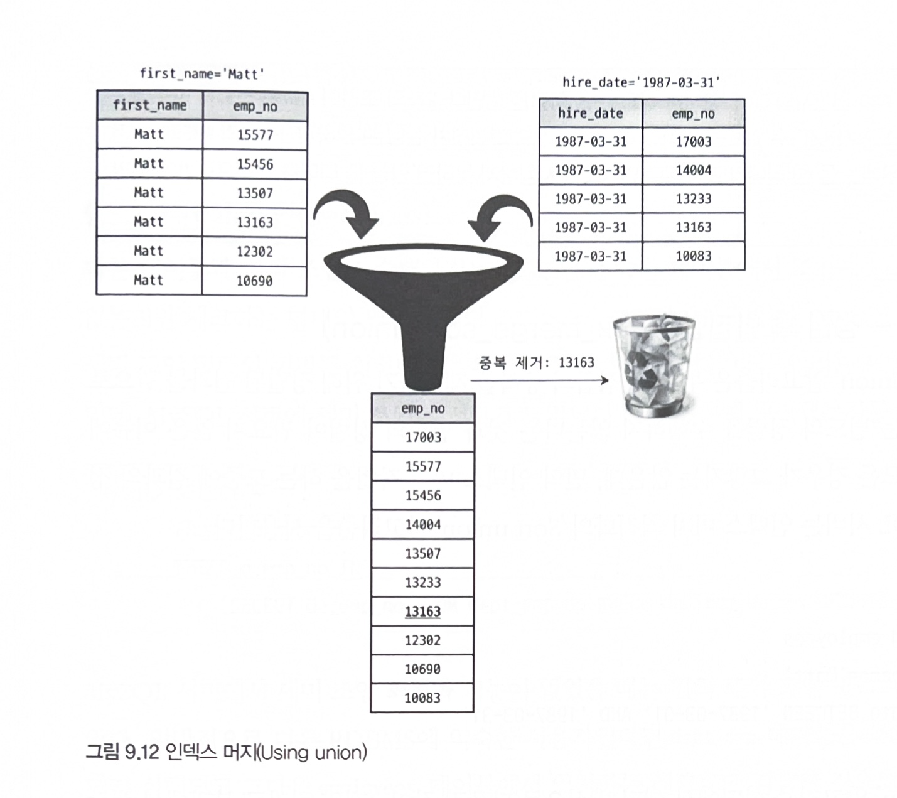
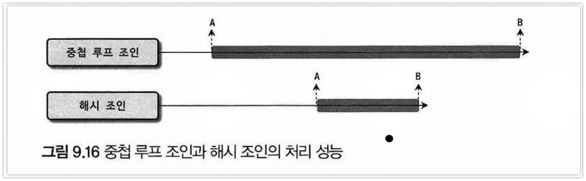
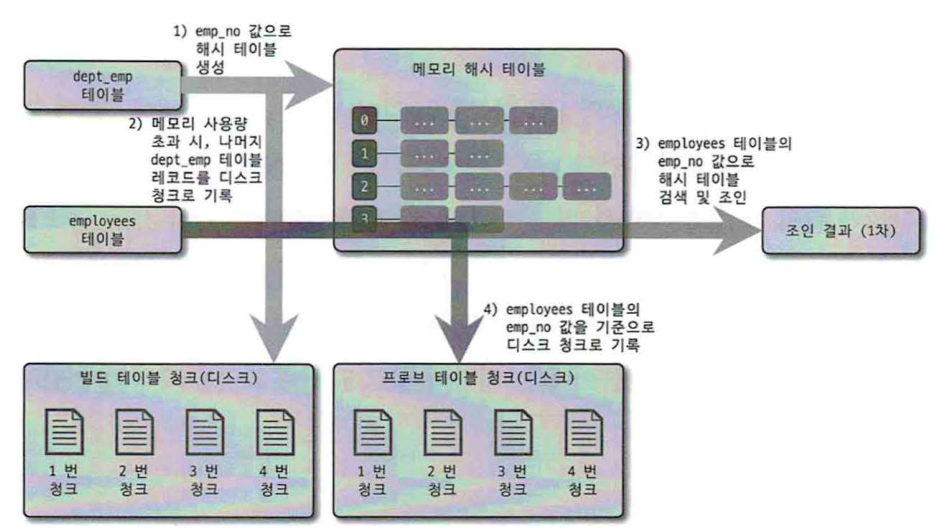

## 1. 개요
- 쿼리의 실행계획을 수랭하는 옵티마이저를 알고 있어야 실행 계획의 불합리한 부분을 찾아내고 더 최적화된 방법으로 실행계획을 수립하도록 유도할 수 있다

### 1. 쿼리 실행 절차
- 쿼리가 실행되는 과정
  1. SQL 문장을 잘게 쪼개서 MySQL서버가 이해할 수 있는 수준으로 분리(파스 트리)한다
        - SQL 파서라는 모듈로 처리되며 문법 오류를 찾아낸다
  2. SQL의 파싱정보(파스 트리)를 확인하면서 어떤 테이블을 읽고 어떤 인덱스를 이용해 테이블을 읽을지 선택한다
        - 불필요한 조건 제거 연산의 단순화, 조인의 경우 읽는 순서 결정, 인덱스 결정, 임시 테이블에 얻고 다시 가공해야 하는지 결정한다
  3. 두번째 단계에서 결정된 테이블의 읽기 순서나 선택된 인덱스를 이용해 스토리지 엔진으로부터 데이터를 가져온다

- 두 번째 단계가 `최적화 및 실행 계획 수립`단계이며 옵티마이저에서 처리한다
- 두 번째 단계가 완료되면 쿼리의 실행계획이 만들어지고 이 계획대로 스토리지 엔진에 레코드를 읽어오라고 시킨다

### 2. 옵티마이저 종류
- 현재 방식인 비용 기반 최적화와 예전 방식인 규칙 기반 최적화 방법이 있다
- **규칙 기반 최적화**
  - 테이블의 레코드 건수나 선택도 등을 고려하지 않고 내장된 우선순위에 따라 실행 계획을 수립한다
  - 같은 쿼리에 대해서 거의 항상 같은 실행 방법을 만들어낸다
  - 하지만 사용자의 데이터는 분포도가 매우 다양하기 때문에 규칙 기반 최적화는 거의 사용되지 않는다
- **비용 기반 최적화**
  - 쿼리를 처리하기 위한 여러 가지 방법을 만들고, 각 작업의 비용정보와 대상 테이블의 예측된 통계 정보를 이용해 실행 계획별 비용을 산출한다
  - 산출된 실행 방법별로 비용이 최소로 소요되는 처리 방식을 선택해 최종적으로 쿼리를 실행한다

## 2. 기본 데이터 처리
- 모든 RDBMS는 데이터를 정렬하거나 그루핑하는 기본 데이터 가공 기능을 가지고 있다

### 1. 풀 테이블 스캔과 풀 인덱스 스캔
- 풀 테이블 스캔
  - 인덱스를 사용하지 않고 테이블의 데이터를 처음붙터 끝까지 읽어서 처리하는 작업이다
  - 다음과 같은 조건일 때 주로 선택한다
    - 테이블 레코드 건수가 너무 작아서 풀 테입르 스캔이 더 빠른 경우 (페이지 1개로 구성된 경우)
    - WHERE 절이나 ON 절에 인덱스를 이용할 수 없는 경우
    - 인덱스 레이진 스캔을 사용할 수 있더라도 레코드 건수가 너무 많은 경우 (B-Tree를 샘플링해서 조사한 통계 정보 기준)

>##### 풀 테이블 스캔
- 테이블 전체 크기 >>>>>> 인덱스 이기 때문에 상당히 많은 디스크 읽기가 필요하다
- 대부분 DBMS는 풀 테이블 스캔시 한꺼번에 여러 개의 블록이나 페이지를 읽어오는 기능을 내장하고 있다
- 한번에 몇 개씩 페이지를 읽어올지 설정하는 시스템변수는 없지만 InnoDB의 경우 연속된 데이터 페이지가 읽히면 백그라운드 스레드에 의해 `리드 어헤드`작업이 자동으로 시작된다
- 풀 테이블 스캔이 실행되면 첫 몇 개의 데이터 페이지는 포그라운드 스레드가 페이지 읽기를 실행하지만 특정 시점부터는 한 번에 4개 또는 8개씩 페이지를 읽으면서 계속 그 수를 증가시킨다
- 최대64개의 데이터 페이지까지 읽어서 버퍼 풀에 저장해둔다
- `innodb_read_ahead_threshold`를 이용해 언제 리드 어헤드를 시작할지 임계값을 설정할 수 있다
- 포그라운드에 의해 시스템 변수에 설정된 개수만큼 연속된 데이터 페이지가 읽히면 백그라운드 스레드를 이용해 대량으로 그다음 페이지들을 읽어서 버퍼 풀로 적재한다
- `리드 어헤드`는 풀 인덱스 스캔에서도 동일하게 사용된다

> ##### 리드어헤드
> 어떤 영역의 데이터가 앞으로 필요해질것을 예측해서 요청이 오기 전에 미리 디스크에 읽어 버퍼 풀에 가져다 두는 것을 의미한다

### 2. 병렬 처리
- 하나의 쿼리를 여러 스레드가 작업을 나누어 동시에 처리하는 것을 의미한다
- `innodb_parallel_read_thread` 시스템 변수를 이용해 하나의 최대를 최대 몇 개의 스레드를 이용해서 처리할지를 변경할 수 있다
- cpu의 코어를 넘어서는 경우에는 오히려 성능이 떨어질 수 있다

```sql
set session innodb_parallel_read_thread=8;
select count(*) from salaries;
```

### 3. ORDER BY 처리(Using filesort)
- 정렬을 처리하는 방법은 인덱스를 이용하는 방법과 쿼리가 실행될 때 `Filesort`라는 별도의 처리를 이용하는 방법으로 나눌 수 있다
- 인덱스 사용
  - 장점
    - CUD를 실행할 때 이미 인덱스가 정렬돼 있어 순서대로 읽기만 해도 되므로 매우 빠르다
  - 단점
    - CUD 작업 시 부가적인 인덱스 추가/삭제 작업이 필요하므로 느리다
    - 인덱스 때문에 디스크 공간이 더 많이 필요하다
    - 인덱스 개수가 늘어날수록 버퍼 풀을 위한 메모리가 많이 필요하다
- Filesort 이용
  - 장점
    - 인덱스를 생성하지 않아도 되므로 인덱스의 단점이 장점이 된다
    - 정렬해야 할 레코드가 많지않으면 메모리에서 처리되므로 충분히 빠르다
  - 단점
    - 정렬 작업이 쿼리 실행 시 처리되므로 건수가 많아질수록 쿼리의 응답 속도가 느리다

>##### 주의
- 레코드를 정렬하기 위해 항상 `Filesort`라는 정렬 작업을 거쳐야 하는 것은 아니다
- 모든 정렬을 인덱스를 이용하도록 튜닝하기란 거의 불가능하다
  - 정렬 기준이 너무 많아서 요건별로 모두 인덱스를 생성하는 것이 불가능한 경우
  - GROUP BY의 결과 또는 DISTINCT 같은 처리의 결과를 정렬해야 하는 경우
  - UNION의 결과와 같이 임시 테이블의 결과를 다시 정렬해야 하는 경우
  - 랜덤하게 결과 레코드를 가져와야 하는 경우

#### 1). 소트 버퍼
- 정렬을 수행하기 위해 할당받은 메모리 공간을 의미한다
- 정렬해야 할 레코드 크기에 따라 가변적으로 증가하지만 최대 사용 가능한 공간은 `sort_buffer_size`로 설정할 수 있다
- 소트 버퍼를 위한 메모리 공간은 쿼리 실행이 완료되면 즉시 반납된다

>##### 정렬해야할 레코드 건수가 소트 버퍼보다 큰 경우
- 정렬해야 할 레코드를 여러 조각으로 나눠서 처리하는데, 임시 저장을 위해 디스크를 사용한다
- 메모리의 소트 버퍼에서 정렬을 수행하고, 그 결과를 임시로 디스크에 저장해 둔다
- 이처럼 각 버퍼 크기만큼 정렬된 레코드를 다시 병합하면서 정렬을 수행해야 한다 (멀티 머지라고도 한다)
- 이 작업들은 디스크 쓰기와 읽기를 유발하며 레코드 건수가 많아질수록 반복 작업의 횟수가 높아진다
- 소트 버퍼를 크게 설정하면 더 빨라질것이라고 생각하지만 실제로는 큰 차이를 보이지 않는다 오히려 큰 메모리 공간 할당으로 성능이 훨씬 떨어질 수 있다
  - 소트 버퍼는 세션 메모리 영역이라 정렬작업이 많아질수록 메모리 공간이 커지고 10MB 이상으로 설정하면 여러 커넥션에서 동시 실행 시 메모리 부족 현상을 겪을 수 있다
- 소트 버퍼를 크게 해서 빠른 성능을 얻을 순 없지만 디스크의 읽기와 쓰기 사용량은 줄일 수 있다
- 데이터가 많거나 디스크 I/O 성능이 낮다면 소트 버퍼 크기를 크게 하는것이 도움이 될 수 있다

#### 2). 정렬 알고리즘
1. <sort_key, rowid>: 정렬 키와 레코드의 로우 아이디만 가져와서 정렬하는 방식
2. <sort_key, additional_fields>: 정렬 키와 레코드 전체를 가져와서 정렬하는 방식으로, 레코드의 칼럼들은 고정 사이즈로 메모리 저장
3. <sort_key, packed_aditional_fields>: 정렬 키와 레코드 전체를 가져와서 정렬하는 방식으로, 레코드의 칼럼들은 가변 사이즈로 메모리 저장
- 첫 번째 방식이 `투 패스`정렬 방식이고 두 번째와 세 번째 방식이 `싱글 패스`정렬 방식이다

##### 1. 싱글 패스 정렬 방식
- 소트 버퍼에 SELECT 칼럼 전부를 담아서 정렬을 수행하는 정렬 방식이다
- 정렬에 필요하지 않는 칼럼까지 전부 읽어서 소트 버퍼에 담고 정렬을 수행한다


##### 2. 투 패스 정렬 방식
- 정렬 대상 칼럼과 프라이머리 키 값만 소트 버퍼에 담아서 정렬을 수행하고, 해당 프라이머리 키로 테이블을 읽는 방식이다
- 싱글 패스보다 먼저 사용하던 방식으로 아직까지도 특정 조건에서는 투 패스를 사용한다
- 테이블을 두 번 읽어야 하는 단점이 있다


>##### 차이점
- 싱글 패스는 더 많은 소트 버퍼 공간을 사용하지만 한번에 끝낼 수 있다
  - 128KB 정렬 버퍼를 사용한다면 투 패스는 7,000건을 정렬할 수 있지만 싱글 패스는 반 정도만 정렬할 수 있다
- 일반적으로 싱글 패스를 사용하지만 다음의 경우 투 패스 정렬 방식을 사용한다
  - 레코드의 크기가 `max_length_for_sort_data`보다 클 때
  - BLOB이나 TEXT 타입의 칼럼이 SELECT 대상에 포함할 때
- 투 패스 정렬 방식은 레코드 크기나 건수가 상당히 많은 경우 효율적이다

##### 3. 정렬 처리 방법
- ORDER BY는 3가지 처리 방법 중 하나로 처리된다. 아래로 내려갈수록 처리 속도는 떨어진다
  - 인덱스를 사용한 정렬 (별도 표기 없음)
  - 조인에서 드라이빙 테이블만 정렬 (Using filesort 표시)
  - 조인에서 조인 결과를 임시 테이블로 저장 후 정렬 (Using temporary 표시)
- 인덱스를 사용할 수 없다면 2가지 방법 중 하나를 선택한다
  - 조인의 드라이빙 테이블만 정렬한 다음 조인을 수행
  - 조인이 끝나고 일치하는 레코드를 모두 가져온후 정렬을 수행
- 조인이 수행되면서 레코드 건수와 레코드 크기는 거의 배수로 불어나기 때문에 가능하다면 드라이빙 테이블만 정렬한 다음 조인을 수행하는 방법이 효율적이다

##### 1). 인덱스를 이용한 정렬
- 반드시 ORDER BY에 명시된 칼럼이 제일 먼저 읽는 테이블(드라이빙 테이블)에 속하고, ORDER BY 순서대로 생성된 인덱스가 있어야 한다
- 또한 WHERE 절에 첫 번째 읽는 테이블의 칼럼에 대한 조건이 있다면 그 조건과 ORDER BY는 같은 인덱스를 사용할 수 있어야 한다
- B-Tree 계열이 아닌 인덱스는 인덱스를 이용한 정렬을 사용할 수 없다
  - R-Tree도 B-Tree 계열이지만 특성상 이 방식을사용할 수 없다
- 여러 테이블이 조인되는 경우에는 네스티드-루프 방식의 조인에서만 이 방식을 사용할 수 있다
- 인덱스를 이용해 정렬이 처리되는 경우에는 정렬이 되어있기 때문에 읽기만 하면 된다
- 조인이 사용된 실행계획에 `조인 버퍼`가 있으면 순서가 흐트러질 수 있기 때문에 주의해야 한다


>##### 주의
- ORDER BY를 넣지 않아도 자동으로 정렬되므로 정렬 작업을 한번 더 할까봐 ORDER BY절을 제거하는 경우도 있다
- 하지만 불필요한 정렬 작업은 수행하지 않는다
  - 인덱스로 정렬이 처리될 때는 ORDER BY가 쿼리에 명시된다고 해서 작업량이 늘지 않는다

##### 2). 조인의 드라이빙 테이블만 정렬
- 첫 번째 테이블의 레코드를 먼저 정렬한 다음 조인을 실행하는 것이 차선책이다
- 이 방법으로 정렬을 처리하려면 조인에서 첫 번째로 읽히는 테이블(드라이빙 테이블)칼러만으로 Order By절을 작성해야 한다

```sql
-- 다음 2가지 조건을 갖추고 있어 employees 테이블을 드라이빙 테이블로 선택할 것이다
-- WHERE절의 검색 조건 emp_no은 employees의 테이블의 프라이머리 키를 이용해 검색해 작업량을 줄일 수 있다
-- 드리븐 테이블의 조인 칼럼인 emp_no 칼럼에 인덱스가 있다

SELECT *
FROM employees e, salaries s
WHERE s.emp_no=e.emp_no
AND e.emp_no BETWEEN 100002 AND 100010
ORDER BY e.last_name;
```


##### 3). 임시 테이블을 이용한 정렬
- 2번을 제외한 조인되면서 정렬을 하게되면 항상 임시 테이블에 저장하고 다시 정렬하는 과정을 거친다
- 정렬의 3가지 방법중 정렬해야 할 레코드 건수가 가장 많기 때문에 가장 느린 정렬 방법이다

```sql
-- 앞선 이유로 employees 테이블이 드라이빙 테이블로 사용된다
-- 정렬 기준이 드리븐 칼럼에 있기 때문에 조인된 데이터를 가지고 정렬할 수 밖에 없다
SELECT *
FROM employees e, salaries s
WHERE s.emp_no=e.emp_no
AND e.emp_no BETWEEN 100002 AND 100010
ORDER BY s.salary;
```



##### 4). 정렬 처리 방법의 성능 비교
- ORDER BY나 GROUP BY 같은 작업은 WHERE 조건을 만족하는 레코드를 LIMIT 건수만큼만 가져와서 처리할 수 없다
  - 조건을 만족하는 레코드를 모두 가져와서 실행해야만 비로소 건수를 제한할 수 있다
- WHERE 조건이 아무리 인덱스를 잘 활용하도록 튜닝해도 잘못된 ORDER BY나 GROUP BY 때문에 쿼리가 느려지느 경우가 자주 발생한다

##### (1). 스트리밍 방식
- 서버 쪽에서 처리할 데이터와 관계없이 조건에 일치하는 레코드를 바로바로 클라이언트로 전송해주는 방식이다
- 쿼리가 스트리밍 방식으로 처리될 수 있다면 레코드를 즉시 전달받기 때문에 동시에 가공 작업을 시작할 수 있다
- 스트리밍 방식으로 처리되는 쿼리는 LIMIT같이 건수 제한은 실행 시간을 상당히 줄여줄 수 있다


##### (2). 버퍼링 방식
- ORDER BY나 GROUP BY 같은 처리는 스트리밍이 불가능하다
- WHERE 조건에 일치하는 모든 레코드를 가져온 후, 정렬하거나 그루핑해서 차례대로 보내야 하기 때문이다
- 모든 작업을 하는 동안 기다려야 하기 때문에 응답속도가 느려진다
- 결과를 모아서 MySQL 서버에서 일괄 가공해야 하므로 LIMIT가 있어도 성능 향상에 별로 도움이 되지 않는다
  - 작업량에는 그다지 변화가 없기 때문이다

- 인덱스를 사용한 정렬 방식만 스트리밍 형태이며, 나머지는 모두 버퍼링 후에 정렬된다
- 

>#### 참고
- MySQL 서버가 스트리밍으로 주더라도 JDBC 라이브러리의 경우 버퍼링으로 처리한다
- 전체 처리 시간이 짧고 통신 횟수가 적어 자원 소모가 적기 때문이다
- JDBC의 버퍼링 처리 방식은 기본 작동 방식이며, 스트리밍 방식으로 변경할 수 있다

##### 4. 정렬 관련 상태 변수
- 지금까지 몇 건의 레코드나 정렬 처리를 수행했는지, 소트 버퍼 간의 병합 작업(멀티 머지)은 몇 번이나 발생했는지 확인해 볼 수 있다

```sql
SHOW STATUS LIKE 'Sort%'

Sort_merge_passes: 멀티 머지 처리 횟수
Sort_range: 인덱스 레인지 스캔을 통해 검색된 결과에 대한 정렬 작업 횟수
Sort_scan: 풀 테이블 스캔을 통해 검색된 결과에 대한 정렬 작업 횟수다. range와 scan둘ㄷ ㅏ 작업 횟수를 누적하고 있는 상태 값이다
Sort_rows: 지금까지 정렬한 전체 레코드 건수를 의미한다
```

### 4. Group BY 처리
- Order By와 같이 스트리밍된 처리를 할 수 없다
- HAVING절은 GROUP BY결과를 필터링 역할을 수행하기 때문에 인덱스를 사용할 수 없다
  - HAVING절을 튜닝하려고 인덱스를 생성하거나 다른 방법을 고민할 필요가 없다
- GROUP BY 작업도 인덱스를 사용하는 경우와 그렇지 못한 경우로 나눠 볼 수 있다
  - 인덱스 사용: 인덱스를 차례대로 읽는 인덱스 스캔 방법과 루스 인덱스 스캔으로 나뉜다
  - 인덱스 사용X: 임시 테이블을 사용한다

#### 1. 인덱스 스캔을 이용하는 GROUP BY(타이트 인덱스 스캔)
- ORDER BY와 마찬가지로 드라이빙 테이블에 속한 칼럼만 이용해 **그룹핑**할 때 인덱스가 있다면 차례대로 읽으면서 그룹핑을 수행하고 조인을 처리한다
  - GROUP BY가 인덱스를 사용해 처리된다 해도 그룹 함수 등의 그룹값을 처리해야 해서 임시 테이블이 필요할 때도 있다
  - GROUP BY가 인덱스를 통해 처리되는 쿼리는 이미 정렬된 인덱스를 읽는 것이므로 추가 정렬작업이 필요지 않다

#### 2. 루스 인덱스 스캔을 이용하는 GROUP BY
- 루스 인덱스 스캔은 인덱스의 유니크한 값의 수가 적을수록 성능이 향상된다
- 루스 인덱스 스캔을 사용할 수 없는 패턴
  - 집합 함수가 사용된 경우
  - GROUP BY에 사용된 칼럼의 순서가 일치하기 않을 경우
  - SELECT 절의 칼럼이 GROUP BY와 일치하기 않는 경우

```sql
-- 인덱스는 (emp_no, from_date)로 생성되어 있다
-- 1. (emp_no, from_date) 인덱스를 차례대로 스캔하면서 emp_no 값이 '10001'을 찾아낸다
-- 2. emp_no이 '10001' 값과 WHERE절의 from_date 조건을 합쳐서 검색한다
-- 3. 그다음 유니크한(그룹 키)값을 가져온다
-- 4. 3번 단계에서 결과가 더 없으면 처리를 종료하고, 결과가 있다면 2번 과정으로 돌아간다
SELECT emp_no
FROM salaries
WHERE from_date = '1985-03-01'
GROUP BY emp_no;
```

#### 3. 임시 테이블을 사용하는 GROUP BY
- 드라이빙, 드리븐 관계없이 인덱스를 전혀 사용하지 못할 경우 이 방식으로 처리된다
- 8.0부터 묵시적인 정렬을 실행하지 않는다
- GROUP BY가 필요한 경우 내부적으로 GROUP BY 절의 칼럼들로 구성된 유니크 인덱스를 가진 임시 테이블을 만들어서 중복 제거와 집합 함수 연산을 수행한다

### 5. DISTINCT 처리
- 집합 함수와 함께 사용되는 경우와 집합 함수가 없는 경우 2가지로 구분하자
- 집합 함수와 같이 DISTINCT가 사용되는 쿼리에서 인덱스를 사용하지 못하는 경우에는 항상 임시 테이블이 필요하다
  - 하지만 실행계획에서는 `Using temporary` 메시지가 출력되지 않는다

#### 1. SELECT DISTINCT
```sql
-- 다음 두 쿼리는 내부적으로 같은 작업을 수행한다
SELECT DISTINCT emp_no
FROM salaries;

SELECT emp_no
FROM salaries
GROUP BY emp_no
```

```sql
-- DISTINCT는 SELECT하는 레코드를 유니크하게 SELECT 하는 것이지, 특정 칼럼만 유니크하게 조회하는 것이 아니다
-- DISTINCT는 함수가 아니므로 그 뒤의 괄호는 의미가 없다
-- SELECT에서 사용되는 DISINTCT 키워드는 모든 칼럼에 영향을 미친다
SELECT DISTINCT(first_name), last_name
FROM employees
```

#### 2. 집합 함수와 함께 사용된 DISTINCT
- 집합 함수 내에서 사용된 DISTINCT는 그 집합 함수의 인자로 전달된 칼럼값이 유니크한 것들을 가져온다
- 인덱스된 칼럼에 대해 DISTINCT 처리를 할 때를 인덱스 풀스캔하거나 레인지 스캔하면서 임시 테이블 없이 최적화된 처리를 수행할 수 있다

```sql
-- 내부적으로 집합함수를 처리하기 위해 임시 테이블을 사용하지만 실행계획에는 표시되지 않는다
-- 조인한 결과에서 salary 칼럼의 값만 저장하기 위한 임시 테이블을 만들어서 사용한다
-- 이때 임시 테이블의 salary 칼럼에는 유니크 인덱스가 생성되기 때문에 레코드 건수가 많아진다면 상당히 느려질 수 있다
SELECT COUNT(DISTINCT s.salary)
FROM employees e, salaries s
WHERE e.emp_no = s.emp_no
AND e.emp_no BETWEEN 100001 AND 100100;

-- COUNT쿼리를 하나 더 추가하면 COUNT를 처리하기 위해 총 2개의 임시테이블을 사용한다
```

### 6. 내부 임시 테이블 활용
- 내부적이라는 단어가 포함된 이유는 `CREATE TEMPORARY TABLE`명령으로 만든 임시 테이블과 다르기 때문이다
- 일반적으로 MySQL 엔진이 사용하는 임시 테이블은 처음 메모리에 생성됐다가 크기가 커지면 디스크로 옮겨진다
  - 특정 예외 케이스는 메모리를 거치지 않고 바로 디스크에 임시 테이블이 만들어진다
- 내부적인 가공을 위해 생성하는 임시 테이블은 다른 세션이나 다른 쿼리에서 볼 수 없으며 사용하는 것도 불가능하다
- 내부적인 임시 테이블은 쿼리의 처리가 완료되는 자동으로 삭제된다

#### 1. 메모리 임시 테이블과 디스크 임시 테이블
- 8.0부터 메모리는 `TempTable`이라는 스토리지 엔진을 사용하고 디스크 임시 테이블은 InnoDB 스토리지 엔진을 사용한다
- 가변 길이 타입도 지원하고 트랜잭션 지원도 가능하다
- `internal_tmp_mem_storage_engine`을 통해 메모리용 임시 테이블을 MEMORY와 TempTable 중에 선택할 수 있고 기본값은 TempTable이다. 크기도 1GB이다
  - 임시 테이블의 크기가 1GB보다 커지면 임시 테이블을 디스크로 기록하고 다음의 2가지 디스크 저장 방식 중 하나를 선택한다
    - MMAP 파일로 디스크에 기록 (기본값)
    - InnoDB 테이블로 기록
- 내부 임시 테이블이 메모리에 생성되지 않고 처음부터 디스크 테이블로 생성되는 경우도 있다

#### 2. 임시 테이블이 필요한 쿼리
- 다음과 같은 패턴은 별도의 데이터 가공 작업이 필요해 내부 임시 테이블을 생성한다
  - ORDER BY와 GROUP BY에 명시된 칼럼이 다른 쿼리
  - ORDER BY나 GROUP BY에 명시된 칼럼이 조인의 순서상 첫 번째 테이블이 아닌 쿼리
  - DISTINCT와 ORDER BY가 동시에 쿼리에 존재하는 경우 또는 DISTINCT가 인덱스로 처리되지 못하는 쿼리
  - UNION이나 UNION DISTINCT가 사용된 쿼리
  - 쿼리의 실행 계획에서 select_type이 DERIVED인 쿼리 (유니크 인덱스가 없는 내부 임시 테이블이 생성된다)
- 유니크 인덱스가 있는 내부 임시 테이블 < 없는 임시 테이블이 더 성능이 좋다
  - 내부 임시 테이블은 중간 버퍼이기 때문에 읽기보다 쓰기가 압도적으로 많기 때문이다

#### 3. 임시 테이블이 디스크에 생성되는 경우
- 다음과 같은 조건을 만족하면 메모리 임시 테이블을 사용할 수 없다
  - UNION이나 UNION ALL에서 SELECT되는 칼럼 중에서 길이가 512바이트 이상인 크기의 칼럼이 있는 경우
  - GROUP BY나 DISTINCT 칼럼에서 512바이트 이상인 칼럼이 있는 경우
  - 메모리 임시 테이블의 크기가 temptable_max_ram보다 큰 경우

#### 4. 임시 테이블 관련 상태 변수
- `Using temporary`가 표시됐다고 어디에서(메모리, 디스크) 처리됐는지 알 수 없고, 몇 개의 임시 테이블이 사용됐는지도 알 수 없다
- 메모리, 디스크에 생성됐는지 확인하려면 `SHOW SESSION STATUS LIKE 'Created_tmp%'`를 확인해보면 된다

## 3. 고급 최적화
- 옵티마이저가 실행 계획을 수립할 때 통계 정보와 옵티마이저 옵션을 결합해서 최적의 실행 계획을 수립한다
- 옵티마이저 옵션은 조인 관련된 옵션과 옵티마이저 스위치로 구분할 수 있다

### 1. 옵티마이저 스위치 옵션
- `optimizer_switch`로 제어한다
- 글로벌과 세션별 모두 설정할 수 있다

```sql
SET GLOBAL optimizer_switch='index_merge=on,index_merge_union=on,...'

SET SESION optimizer_switch='index_merge=on,index_merge_union=on,...'
```

#### 1. MRR과 배치 키 액세스(mrr & batched_key_access)
- MRR: Multi-Rnage Read이며 DS-MRR이라고도 한다
- 네스티드 루프 조인: 드라이빙 테이블의 레코드를 한 건 읽어서 드리븐의 일치하는 레코드를 찾아서 조인을 수행하는 것이다.
  - 조인 처리는 MySQL 엔진이 처리하지만, 실제 레코드를 검색하고 읽는 부분은 스토리지 엔진이 담당한다
  - 드라이빙 테이블 레코드 건별로 드리븐 테이블의 레코드를 찾으면 스토리지 엔진에서는 아무런 최적화를 수행할 수 없다
- MRR: 네스티드 루프 조인의 단점을 보완하기 위해 `조인 대상 테이블`중 하나에서 레코드를 읽어서 조인 버퍼에 버퍼링한다
  - 즉시 조인하지 않고 버퍼링하여 가득차면 레코드들을 스토리지 엔진에 한 번에 요청한다
  - 데이터 페이지에 정렬된 순서대로 접근해서 읽기를 최소화할 수 있게 된다
  - MRR을 응용해서 실행되는 방식을 BKA(Batched Key Access)조인이라고 한다. 기본값은 비활성화이며 트레이드 오프가 있다

#### 2. 블록 네스티드 루프 조인
- 대부분 사용되는 조인방법으로 조인의 연결 조건이 되는 칼럼에 모두 인덱스가 있는 경우 사용된다
- 중첩문(for문)처럼 작동한다고 해서 네스티드 루프 조인이다
- 네스티드 루프 조인의 경우 버퍼 공간에 저장하지 않고 즉시 드리븐 테이블의 레코드를 찾아서 반환한다 
- 네스티드 루프 조인과 가장 큰 차이점은 조인버퍼 사용여부와 드라이빙, 드리븐이 어떤 순서로 조인되느냐이다
  - 드라이빙 테이블은 한 번에 쭉 읽지만 드리븐 테이블은 여러 번 읽는다
  - 드리븐 테이블의 조인 조건이 **인덱스**를 이용할 수 없다면 풀 테이블 스캔을 하기 때문에 상당히 느려진다
  - 인덱스 풀 스캔을 피할 수 없다면 드라이빙 레코드를 캐시한 후 (조인 버퍼) 조인하는 형태로 처리한다
  - 조인 버퍼가 사용되는 조인에서는 결과의 정렬 순서가 흐트러질 수 있다

>##### 주의
> 8.0.20부터는 블록 네스티드 루프 조인은 더이상 사용되지 않고 해시 조인 알고리즘이 대체되어 사용된다




#### 3. 인덱스 컨디션 푸시다운
- 인덱스 컨디션 푸시다운이 작동하지 않을 때 first_name이라는 인덱스가 있음에도 해당 칼럼을 이용하지 않고 다시 레코드를 읽어서 처리한다
  - `first_name LIKE '%sal'`은 MySQL 엔진이 수행하고 인덱스 비교작업은 스토리지 엔진이 수행하기 때문이다



- 5.6부터 인덱스에 포함된 칼럼의 조건이 있다면 모두 모아서 스토리지 엔진으로 전달될 수 있게 핸들러 API가 개선되었다



#### 4. 인덱스 확장
- `use_index_extentions` 옵티마이저 옵션은 **세컨더리에 자동으로 추가된 프라이머리 키**를 활용할 수 있게 할 지를 결정하는 옵션이다
- 프라이머리 키가 센컨더리 인덱스에 포함되어 있으므로 정렬작업도 인덱스를 활용해서 처리된다

```sql
-- 세컨더리 인덱스는 프라이머리 키를 순서대로 포함한다
-- 즉 ix_fromdate는 (from_date, dept_no, emp_no) 조합으로 인덱스를 생성한 것과 흡사하게 작동한다
CREATE TABLE dept_emp(
  PRIMARY KEY (dept_no, emp_no),
  KEY ix_fromdate (from_date)
)
```

#### 5. 인덱스 머지
- 인덱스를 이용한 쿼리는 대부분 하나의 인덱스만 사용하도록 실행 계획을 수립한다
- 하지만 인덱스 머지 시행 계획을 사용하면 하나의 테이블에 2개 이상의 인덱스를 이용해 쿼리르 처리한다
- 하나의 인덱스만 사용하는 것이 효율적이지만 쿼리에 사용된 각각의 조건이 서로 다른 인덱스를 사용할 수 있고 그 조건을 만족하는 레코드 건수가 많을 것으로 예상되면 인덱스 머지 실행 계획을 선택한다
- 인덱스 머지 실행 계획은 3개의 세부 실행계획으로 나눌 수 있다
  - index_merge_intersection
  - index_merge_sort_union
  - index_merge_union

#### 6. 인덱스 머지 - 교집합(index_merge_intersection)
- 하나의 인덱스만 사용하는 것이 더 성능좋을 것이라고 생각하면 `index_merge_intersection`을 비활성화하면 된다

```sql
-- employees 테이블의 first_name 칼럼과 emp_no 칼러 모두 각각 인덱스를 가지고 있다
-- Extra 칼럼에 Using intersect라고 표시된 것은 여러 개의 인덱스를 가각 검색해서 그 결과의 교집합만 반환했다는 뜻이다

SELECT *
FROM employees
WHERE first_name = 'Georgi'
AND emp_no BETWEEN 10000 AND 20000
```

#### 7. 인덱스 머지 - 합집합(index_merge_union)
- WHERE절에 사용된 2개 이상의 조건이 각각의 인덱스를 사용하되 OR 연산자로 연결된 경우 사용되는 최적화다
- Union 알고리즘은 프라이머리 키로 값이 중복된 레코드들을 하나씩 비교하면서 걸어낸다
  - 두 집합의 결과를 하나씩 가져와 중복 제거를 수행할 떄 사용된 알고리즘은 우선순위 큐이다



> ##### 주의
> AND 연산자와 OR 연산자는 큰 차이를 보인다
> AND로 연결된 경우 하나라도 인덱스를 사용할 수 있다면 인덱스 레인지 스캔으로 실행된다
> 하지만 OR 연산자는 하나라도 제대로 인덱스를 사용하지 못하면 풀 테이블 스캔밖에 처리하지 못한다

#### 8. 인덱스 머지 - 정렬 후 합집합(index_merge_sort_union)
- 인덱스 머지를 하는 동안 저열이 필요한 경우 `Sort Union`알고리즘을 사용한다
- 두 집합의 결과에서 중복을 제거하기 위해 정렬한 다음 중복 제거를 수행해야 할 때 사용된다

#### 9. 세미 조인
- 실제로 조인하지 않고 다른 테이블에서 조건에 일치하는 레코드가 있는지만 체크하는 형태의 쿼리를 의미한다
- 세미 조인 형태와 안티 세미 조인 형태의 최적화 방법은 차이가 있다
- 세미 조인 형태: `= (subquery)` 형태와 `IN (subquery)`는 3가지 최적화 방법을 적용할 수 있다
  - 세미 조인 최적화
  - IN-to-EXISTS 최적화
  - MATERIALIZATION 최적화
- 안티 세미 조인 형태: `<> (subquery)` 형태와 `NOT IN (subquery)`는 2가지 최적화 방법이 있다
  - IN-to_EXISTS 최적화
  - MATERIALIZATION 최적화
- 서브쿼리 최적화 중에서 최근 도입된 최적화가 있다
  - Table Pull-out
  - Duplicate Weed-out
  - First Match
  - Loose Scan
  - Materialization

#### 10. 테이블 풀 아웃(Table Pull-out)
- 서브쿼리에 사용된 테이블을 아우터 쿼리로 끄집어낸 후에 쿼리를 조인 쿼리로 재작성하는 방법이다
- 서브쿼리 최적화가 도입되기 이전에 수동으로 쿼리를 튜닝하던 대표적인 방법이다
- `SHOW WARNINGS`을 통해 확인할 수 있고, IN 내의 서브쿼리가 사라지고 JOIN으로 쿼리가 재작성된 것을 확인할 수 있다
- 최적화의 몇 가지 제한 사항과 특성이 있다
  - 세미 조인 서브쿼리에서만 사용 가능하다
  - 서브쿼리 부분이 유니크 인덱스나 프라이머리 키 룩업으로 결과가 1건인 경우에만 사용 가능하다
  - Table pullout이 적용되더라도 기존 쿼리에서 가능했던 최적화 방법이 사용 불가능한 것은 아니므로 MySQL에서는 가능하다면 Table pullout 최적화를 최대한 적용한다
  - 서브쿼리를 아우터 쿼리로 끄집어 낼 수 있다면 서브쿼리 자체는 사라진다
  - 이제부터는 서브쿼리를 조인으로 풀어서 사용할 필요가 없다

#### 11. 퍼스트 매치(FirstMatch)
- IN 형태의 세미 조인을 `EXISTS (subquery)` 형태로 튜닝한 것과 비슷한 방법으로 실행된다
- 서브쿼리가 아니라 조인으로 풀어서 실행하면서 일치하는 첫번째 레코드만 검색하는 최적화를 실행한다
- 제한사항과 특성이 있다
  - 서브쿼리에서 하나의 레코드만 검색되면 더이상 검색을 멈추는 단축 실행 경로이기 때문에 FirstMatch 최적화에서 서브쿼리는 그 서브쿼리가 참조하는 모든 아우터 테이블이 먼저 조회된 이후에 실행된다
  - 상관 서브쿼리에서도 사용될 수 있다
  - GROUP BY나 집합 함수가 사용된 서브쿼리의 최적화에는 사용될 수 없다

```sql
SELECT *
FROM employees e
WHERE e.first_name = 'Matt'
  AND e.emp_no IN (SELECT t.emp_no
                   FROM titles t
                   WHERE t.from_date BETWEEN '1995-01-01' AND '1995-01-30');
```

#### 12. 루스 스캔(loosescan)
- 루스 인덱스 스캔과 비스한 읽기 방식을 사용한다
- 루스 인덱스 스캔으로 서브쿼리 테이블을 읽고, 그 다음 아우터 테이블을 드리븐을 사용해서 조인을 수행한다

#### 13. 구체화(Materialization)
- 세미 조인에 사용된 서브쿼리를 통쨰로 구체화해서 쿼리를 최적화한다는 의미이다
- 구체화: 내부 임시 테이블을 생성한다는 뜻이다
- 몇 가지 제한 사항과 특성이 있다
  - `IN (subquery)`에서 서브쿼리는 상관 서브쿼리가 아니어야 한다
  - 서브쿼리는 GROUP BY나 집합 함수들이 사용돼도 구체화를 사용할 수 있다
  - 구체화가 사용된 경우에는 내부 임시 테이블이 사용된다

#### 14. 중복 제거(Duplicated Weed-out)
- 세미 조인 서브쿼리를 일반적인 Inner Join으로 바꿔서 실행하고 마지막에 중복된 레코드를 제거하는 방법이다
- Inner Join + Group by 절로 바꿔서 실행하는 것과 동일한 작업으로 쿼리를 처리한다
- 다음과 같은 장점과 제약 사항이 있다
  - 서브쿼리가 상관 서브쿼리라고 하더라도 사용할 수 있다
  - 서브쿼리가 GROUP BY나 집합 함수가 사용된 경우에는 사용될 수 없다
  - 서브쿼리의 테이블을 조인으로 처리하기 때뭉네 최적화할 수 있는 방법이 많다

#### 15. 컨디션 팬아웃(condition_fanout_filter)
- 조인을 실행할 때 테이블의 순서는 쿼리의 성능에 큰 영향을 미친다
- 해당 기능을 활성화하면 옵티마이저는 더 정교한 계산을 거쳐서 실행 계획을 수립한다

#### 16. 파생 테이블 머지(derived_merge)
- FROM절에 사용된 서브쿼리를 파생 테이블(Derived Table)이라고 부른다
- 내부적으로 임시 테이블을 생성하고 테이블에서 레코드를 읽어 임시 테이블로 Insert를 한다 그리고 다시 임시 테이블을 읽으므로 오버헤드가 더 추가된다
- 임시 테이블에 저장될 레코드 건수가 많아지면 디스크로 다시 기록되어야 해서 쿼리의 성능이 많이 느려진다
- 5.7부터 서브쿼리를 외부쿼리로 병할 할 수 있게 되었다
- 하지만 다음과 같은 경우 서브쿼리를 외부 쿼리로 병합할 수 없게 된다
  - SUM() 또는 MIN, MAX같은 집계함수와 윈도우 함수가 사용된 서브쿼리
  - DISTINCT가 사용된 서브쿼리
  - GROUP BY나 HAVING이 사용된 서브쿼리
  - LIMIT이 사용된 서브쿼리
  - UNION 또는 UNION ALL을 포함하는 서브쿼리
  - SELECT절에 사용된 서브쿼리
  - 값이 변경되는 사용자 변수가 사용된 서브쿼리

#### 17. 인비저블 인덱스(use_invisible_indexes)
- 8.0부터 인덱스의 가용 상태를 제어할 수 있는 기능이 추가됐다
  - 인덱스를 삭제하지 않고 해당 인덱스를 사용하지 못하게 제어하는 것이다
- `ALTER TABLE employees ALTER INDEX ix_hiredate INVISIBLE`
  - 옵티마이저가 해당 인덱스를 사용하지 못하게 변경
- `SET optimizer_switch='user_invisible_indexes=on'`을 하면 옵티마이저가 INVISIBLE 상태의 인덱스도 볼 수 있다

#### 18. 스킵 스캔(skip_scan)
- 앞서 얘기한 스킵 스캔과 동일하고 선행 칼럼이 조건절에 사용되지 않더라도 사용하는 기법이다

#### 19. 해시 조인(hash_join)
- 해시 조인은 첫 번째 레코드를 찾는 데는 오래 걸리지만 최종 레코드를 찾는 데까지는 많이 걸리지 않는다
- 즉 해시 조인은 최고 스루풋 전략에 적합하며, 네스티드 루프 조인은 최고 응답 속도 전략에 적합하다는 것을 알 수 있다
  - 일반적인 웹 서비스는 응답속도가 더 중요하기 때문에 네스티드가 더 나을 때가 있다
- 이런 이유로 레코드 건수가 매우 적은 겨웅에 한해서만 해시 조인 알고리즘을 사용하도록 되어 있다



- 일반적으로 빌드 단계와 프로브 단계로 나뉘어 처리된다
  - 빌드 단계: 조인 대상 테이블 중에서 레코드 건수가 적어서 해시 테이블로 만들기에 용이한 테이블을 골라서 메모리에 해시 테이블을 생성하는 작업을 수행한다. 빌드 단계에서 해시 테이블을 만들 때 사용되는 원본 테이블을 빌드 테이블이라고도 한다
  - 프로브 단계: 나머지 테이블의 레코드를 읽어서 해시 테이블의 일치 레코드를 찾는 과정을 의미한다. 
- `join_buffer_size`의 기본 크기는 256KB인데 이보다 큰 경우 청크로 분리한 후 청크별로 메모리에서 처리가 가능한 경우 메모리로 처리하고 아니라면 디스크에서 읽어 처리한다

  

#### 20. 인덱스 정렬 선호(prefer_ordering_index)
- ORDER BY 또는 GROUP BY 인덱스를 사용해 처리 가능한 경우 실행계획에서 인덱스의 가중치를 높이 설정해서 실행된다

```sql
-- 이 쿼리는 대표적으로 다음 2가지 실행계획을 선택할 수 있다
-- hire_date 인덱스를 이용해 찾는다음 emp_no로 정렬해서 결과를 반환
-- 프라이머리 키인 emp_no으로 정순으로 읽으면서 hire_date 칼럼의 조건에 일치하는지 비교 후 결과를 반환
SELECT *
FROM employees
WHERE hire_date BETWEEN '1985-01-01' AND '1985-02-01'
ORDER BY emp_no;
```

- 8.0.21부터 ORDER BY를 위한 인덱스에 너무 가중치를 부여하지 않도록 `prefer_ordering_index`옵션이 추가됐다
- 기본값은 ON이지만 옵티마이저가 자주 실수를 한다면 OFF로 변경하면 된다
- `SET SESSION optimizer_switch='prefer_orering_index=OFF'`

### 2. 조인 최적화 알고리즘
- 조인의 실행 계획 최적화를 위한 알고리즘이 2개가 있다
- 다음 쿼리 문장을 어떻게 처리하는지 알아보자
  - `SELECT * FROM t1, t2, t3, t4 WHERE ...`

#### 1. Exhaustive 검색 알고리즘
- 5.0이전에 사용되던 조인 최적화 기법으로 모든 테이블 조합에 대해 비용을 계산해서 최적의 조합 1개를 찾는 방법이다
- 테이블이 20개라면 20! = 3,628,800개라서 시간이 엄청 걸린다


#### 2. Greedy 검색 알고리즘
1. 전체 N개의 테이블 중에서 `optimizer_serach_depth`변수에 정의된 개수의 테이블로 가능한 조인 조합 생성
2. 1번에서 생성된 조인 조합 중에서 최소 비용 실행 계획 선정
3. 2번에서 선정된 실행 계획의 **첫 번째 테이블**을 부분 실행계획의 첫 번째 테이블로 선정
4. 전체 N-1개의 테이블 중에서 `optimizier_serach_depth`변수에 정의된 개수의 테이블로 가능한 조인 조합을 생성
5. 4번에서 생성된 조인 조합들을 하나씩 3번에서 생성된 `부분 실행 계획`에 대입해 실행 비용을 계산
6. 5번의 비용 계산 결과, 최적의 실행 계획에서 두 번째 테이블을 3번에서 생성된 `부분 실행 계획`의 두 번째 테이블로 선정
7. 남은 테이블이 모두 없어질 때까지 4~6번까지의 과정을 반복 실행하면서 조인 순서를 기록
8. 최종적으로 `부분 실행 계획`이 테이블의 조인 순서로 결정됨


## 4. 쿼리 힌트
- MySQL 서버는 우리의 비즈니스를 100% 이해하지 못해서 옵티마이저에게 쿼리의 실행 계획을 어떻게 수립해야 할 지 알려줘야 할 때도 있다
- MySQL에서 사용 가능한 쿼리 힌트는 2가지가 있다
  - 인덱스 힌트: `USE INDEX`같은 힌트를 의미한다
  - 옵티마이저 힌트: 5.6부터 새롭게 추가되기 시작한 힌트들을 지칭한다

### 1. 인덱스 힌트
- ANSI-SQL 표준 문법을 준수하지 못하기 때문에 가능하다면 옵티마이저 힌트를 사용할 것을 추천한다
- SELECT 명령과 UPDATE 명령에서만 사용할수 있다

#### 1. STRAIGHT_JOIN
- 옵티마이저 힌트인 동시에 조인 키워드이기도 하다
- SELECT, UPDATE, DELETE 쿼리에서 여러 개의 테이블이 조인되는 경우 조인 순서를 고정하는 역할을 한다
- 다음 쿼리는 어느 테이블이 드라이빙 도리지 알 수 없고 그때그때 각 테이블의 통계 정보와 쿼리의 조건을 기반으로 가장 최적이라고 판단되는 순서로 조인한다

```sql
SELECT *
FROM employees e, dept_emp de, departments d
WHERE e.emp_no=de.emp_no
AND d.dept_no=de.ept_no;
```

- 조인 순서를 변경하려는 순서에 사용할수 있다
- STRAIGHT_JOIN힌트와 비슷한 역할을 하는 옵티마이저 힌트는 다음과 같이 것들이 있다
  - JOIN_FIXED_ORDER: STRAIGHT_JOIN과 동일한 효과로 FROM절의 조인 순서가 결정되는 효과를 낸다
  - JOIN_ORDER: 나머지 3개는 일부 테이블의 조인 순서에 대해섬나 제안하는 힌트이다
  - JOIN_PREFIX
  - JOIN_SUFFIX

```sql
-- FROM 절에 명시된 테이블의 순서대로 조인을 수행한다
SELECT STRAIGHT_JOIN
e.first_name, e.last_name, d.dept_name
FROM employees e, dept_emp de, departments d
WHERE e.emp_no=de.emp_no
AND d.dept_no=de.ept_no;
```

#### 2. USE INDEX / FORCE INDEX / IGNORE INDEX
- 인덱스를 가지는 테이블 뒤에 힌트를 명시해야 한다
- 3~4개 이상의 칼럼을 포함하는 비슷한 인덱스가 여러 개 존재하는 경우 특정 인덱스를 사용하도록 힌트를 추가한다
- 인덱스 힌트는 크게 3종류가 있고, 모두 키워드 뒤에 사용할 인덱스의 이름을 괄호로 묶어서 사용한다
  - 프라이머리 키는 `PRIMARY`라고 명시하면 된다

1. USE INDEX: 인덱스를 사용하도록 권장하는 힌트 정도로 생각하면 된다. 항상 그 인덱스를 사용하는 것이 아니다
2. FORCE INDEX: USE INDEX를 부여했는데도 사용하지 않는다면 FORCE_INDEX를 사용해도 그 인덱스를 사용하지 않는다
3. IGNORE INDEX: 옵티마이저가 풀 테이블 스캔을 유도하기 위해 사용할 수도 있다

- 용도를 명시해줄 수도 있다
  - USE INDEX FOR JOIN: 조인뿐만 아니라 레코드를 검색하기 위한 용도까지 포함하는 용도이다
  - USE INDEX FOR ORDER BY: ORDER BY 용도로만 사용할 수 있게 제한한다
  - USE INDEX FOR GROUP BY: 명시된 인덱스를 GROUP BY 용도로만 사용할 수 있게 제한한다

```sql
SELECT * 
FROM employees FORCE INDEX(primary)
WHERE emp_no=10001
```

#### 3. SQL_CALC_FOUND_ROWS
- LIMIT을 만족하는 수만큼 레코드르 찾았더라도 끝까지 검색을 수행한다
- 페이징처리 할 때 사용되지만 쿼리를 2번 처리하므로 사실상 똑같고 오히려 더 느리다

```sql
SELECT SQL_CALC_FOUND_ROWS * 
FROM employees
WHERE first_name='Georgi'
LIMIT 0, 20;

SELECT FOUND_ROWS() AS total_record_count;
```

### 2. 옵티마이저 힌트
- 종류가 매우 다양하며, 힌트가 미치는 영향 범위도 매우 다양하다

#### 1. 옵티마이저 힌트 종류
- 영향 범위에 따라 4개의 그룹으로 나눌 수 있다
  - 인덱스: 특정 인덱스의 이름으로 사용할 수 있는 옵티마이저 힌트
  - 테이블: 특정 테이블의 이름을 사용할 수 있는 옵티마이저 힌트
  - 쿼리 블록: 특정 쿼리 블록에 사용할 수 있는 옵티마이저 힌트로서, 힌트가 명시된 쿼리 블록에서만 영향을 미친다
  - 글로벌: 전체 쿼리에 대해서 영향을 미치는 힌트

#### 2. MAX_EXECUTION_TIME
- 유일하게 쿼리으 실행계획에 영향을 미치는 않는 힌트이다
- 단순히 쿼리의 최대 실행 시간을 설정하는 힌트다
- 밀리초 단위로 시간을 설정하고 지정된 시간을 초과하면 실패하게 된다
```sql
SELECT /*+ MAX_EXECUTION_TIME(100) */ *
FROM employees
ORDER BY last_name
LIMIT 1
```